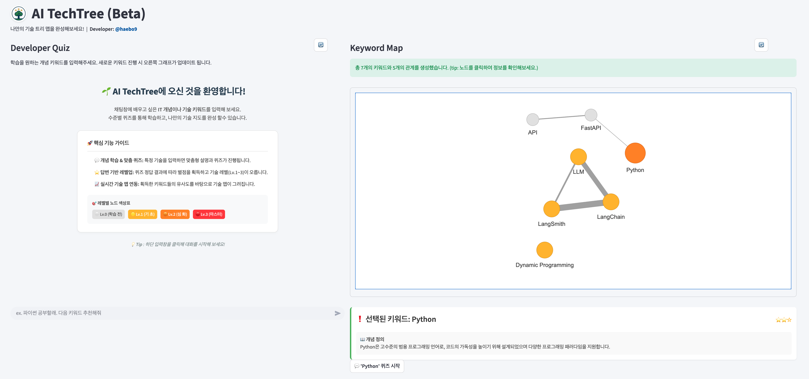
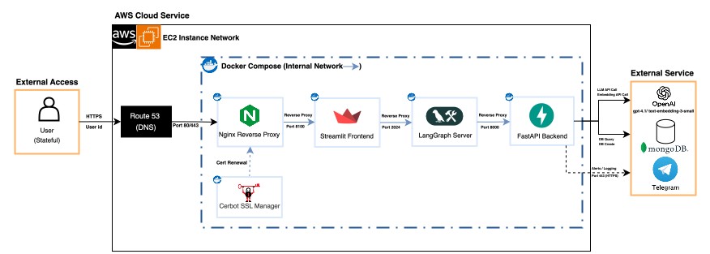
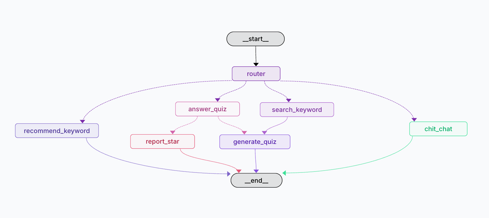

# 개발자의 성장이 게임이 되는 곳, AI TechTree
> ### 👉 [서비스 바로가기](https://techtree.haebo.pro) 👈

@haebo9 🇰🇷

 

> **AI TechTree**는 기술 용어를 중심으로 단계별 면접에 게임처럼 도전하여 자신의 실력을 확인받는 서비스입니다. 
>
> * **🕵️ 키워드 AI 면접**: 면접을 원하는 키워드를 입력하고 도전해보세요! AI가 다양한 문제를 생성합니다 !
> * **⚔️ 심층 평가 AI**: 문제별 정답을 AI가 평가하고 즉각적인 피드백을 제공합니다 ! 
> * **🌳 레벨 도전 시스템**: 부분 정답의 경우 재도전을 ! 정답의 경우 다음 레벨 도전 !
> * **📊 진행상황 시각화**: 내가 도전했던 키워드들을 유사도를 기반으로 정리하여 시각화합니다 !
>
> ---
>
> 💡 **[Engineering Philosophy]**  
> 본 프로젝트는 동적이면서도 통제된 **에이전틱한 작업 흐름**을 통해, 서비스의 실행의 정확도를 높히면서도 AI 주도적으로 작동하도록 설계되었습니다.
>
> 💡 **[Service Philosophy]**  
> 본 서비스는 **메타인지** 교육법에 영향을 받았으며, 문제에 대한 즉각적인 피드백과 반복적인 도전을 통해 학습 효과를 극대화합니다. 

## 👑 서비스 작동 화면 (v.1.1.0)

## 📖 Index
- [Documentation](#-documentation): 기획 및 설계 문서  
- [Tech Stack](#-tech-stack): 사용 기술 및 도구  
- [Architecture](#-architecture): 시스템 구조  
- [Git & Deployment](#-git--deployment): 브랜치 전략 및 배포  
- [Version History](#-version-history): 버전별 변경 사항  
- [Getting Started](#-getting-started): 설치 및 실행 방법

---

## ⭐ Documentation

> 프로젝트의 모든 기획 및 설계 문서는 `docs` 디렉토리 내에서 코드와 함께 관리됩니다.

### 📂 Documentation Structure

| Directory | Description | Key Documents |
| --- | --- | --- |
| [**1_prd**](docs/1_prd) | **기획 (Product Spec)** 요구사항 및 서비스 흐름 정의 | • [핵심 기능 명세](docs/1_prd/product_spec.md) • [페르소나 정의](docs/1_prd/personas.md) • [서비스 흐름도](docs/1_prd/user_flow.md)  |
| [**2_design**](docs/2_design) | **설계 (System Design)** 시스템 아키텍처 및 기술 설계 | • [시스템 아키텍처](docs/2_design/architecture.md) • [AI 에이전트 설계](docs/2_design/agent_workflow.md)  |
| [**3_knowledge**](docs/3_knowledge) | **지식 (Knowledge Base)** 기술 의사결정 및 참고 자료 | • [기술 스택 선정](docs/3_knowledge/tech_decisions.md) • [참고 자료](docs/3_knowledge/references.md) |

👉 [전체 문서 보러가기](docs/README.md) 
👉 [개발 과정 보러가기](dev_log.md) 
👉 [파일 구조 보러가기](STRUCTURE.md)

---

## ⭐ Tech Stack

> 프로젝트에 사용된 핵심 기술 및 인프라 구성입니다.

| Category | Technology | Description |
| --- | --- | --- |
| **Frontend** |  | Interactive UI/UX & Visualization |
| **Backend** |     | High-Performance API & Container |
| **AI / LLM** |     | AI Agents & Workflow Orchestration |
| **ExternalAPI** |   | External API Integration |
| **Cloud/DB** |    | Cloud Infrastructure & Database |

--- 
## ⭐ Architecture
- **Frontend**: `Streamlit`로 구축됩니다. (추후 Next.js로 변경 예정)
- **Backend**: `FastAPI` 서버를 `Docker container`로 빌드하여 `AWS(EC2)`에서 실행합니다.
- **Database**: `MongoDB Atlas`를 사용하여 데이터 안정성을 확보합니다.
- **AI Engine**: `LangGraph` 기반의 Agent 시스템이 퀴즈 생성 및 평가를 수행합니다.

> **System Architecture**

> **LangGraph Workflow**

---
## ⭐ Git & Deployment

> 본 프로젝트는 **개발(Dev)** 과 **운영(Prod)** 환경을 철저히 분리하여 데이터 안정성과 배포 속도를 모두 확보했습니다.
> **Docker 기반의 일관된 환경**과 **AWS의 클라우드 자원**을 효율적으로 결합하여 **Cost-Effective**한 인프라를 구축했습니다.

| Branch | Action & Role | Frontend | Backend | Database |
| :--- | :--- | :--- | :--- | :--- |
| **`develop`** | **Develop & Test** 개발 및 로컬 테스트 | **Localhost / Preview** (Dev Environment) | **Local Docker** (Consistency Test) | **MongoDB Atlas** (Dev) |
| **`main` / `Tag`** | **Production** 실제 라이브 서비스 | **Vercel Prod** (Edge Network + CDN) | **AWS EC2** (t3.micro + Docker) | **MongoDB Atlas** (Prod) |

---

## ⭐ Version History

> 프로젝트의 주요 릴리즈 및 변경 사항 내역입니다. 
> 상세한 개발 일정과 스프린트 계획은 [Sprint Roadmap](docs/1_prd/sprint_roadmap.md) 문서를 참고하세요.

| Version | Feature | KeyTechnology | Release Date |
| :--- | :--- | :--- | :--- |
| **v1.0.0** | **MCP Tool Calling Agent** MCP tool을 활용한 챗봇 서비스 | Langchain, MCP, FastAPI, AWS, streamlit | 2026.01.15|
| **v1.1.0** | **Agentic Quiz System** 키워드 기반 동적 문제 풀이 서비스 | LangGraph, MongoDB, Langsmith, streamlit | 2026.03.02 (Now)  |
| **v1.2.0** | **Web Service & Agent** 복합적이고 유동적인 면접 서비스 | LangGraph, FastAPI, Next.js, Vercel | 2026.03.21  |
| **v2.0.0** | **AI TechTree Full Release** 정식 서비스 출시 | LangGraph, RAG, MongoDB, Next.js, Vercel | 2026.04.11  |

---

## ⭐ Getting Started
> 자세한 구축 과정은 [Deploy Guide(v.1.1)](backend/deploy_guide_v1.1.md) 문서를 참고하세요.

### Prerequisites (v1.1 Deployment)
- **Environment**:
   - Docker & Docker Compose
   - Python 3.13.11+
- **API Keys**(.env):
   - MONGODB_URL
   - DB_NAME
   - OPENAI_API_KEY
   - TAVILY_API_KEY
   - LANGCHAIN_API_KEY
- **Infrastructure**:
   - MongoDB Atlas (Database)
   - AWS EC2 Instance (Backend)
   - SSL Certificate (via Certbot/Nginx)

