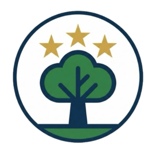

# TechTree
### AI 실시간 음성 모의면접 서비스

서비스: [https://techtree.haebo.pro](https://techtree.haebo.pro)



<br/>

> **TechTree**는 지원자의 이력서와 채용 공고를 기반으로 AI 면접관이 실시간 음성 면접을 진행하고, 면접 후 대화 근거 기반 평가 리포트를 이메일로 발송하는 서비스입니다.
>
> 핵심 목표는 단순한 질문 생성이 아니라 **입력 자료 분석 → 저지연 음성 면접 → 구조화 평가 → 다음 면접을 위한 운영 지침 개선**까지 하나의 제품 흐름으로 연결하는 것입니다.
>
> - **Realtime Interview**: 브라우저와 OpenAI Realtime API를 WebRTC로 직접 연결해 지연을 줄이고, Space 기반 Push-to-Talk로 답변 타이밍을 사용자가 제어합니다.
> - **Resume/JD Grounding**: PDF/TXT 이력서와 채용 공고 텍스트/이미지를 분석해 지원 직무에 맞는 질문 맥락을 구성합니다.
> - **Grounded Report**: 면접 transcript를 LangGraph evaluator가 분석해 점수, 강점, 개선점, Q&A 피드백, 답변 습관, 자기소개 개선안을 생성합니다.
> - **Prompt Memory**: 원문 대화를 장기 저장하지 않고 비식별 Reflection/Policy를 축약 저장해 다음 유사 면접의 프롬프트 지침으로 선별 주입합니다.

[TechTree Service UI](docs/service_screens.md)


## Index
- [Current Service Flow](#-current-service-flow): 현재 서비스 흐름
- [Project Highlights](#-project-highlights): 포트폴리오 관점의 핵심 구현 성과
- [Tech Stack](#-tech-stack): 사용 기술 및 도구
- [Architecture & Agent Workflow](#-architecture--agent-workflow): 시스템 구조
- [Documentation](#-documentation): 기획 및 설계 문서
- [Git & Deployment](#-git--deployment): 브랜치 전략 및 배포
- [Version History](#-version-history): 버전별 변경 사항
- [Getting Started](#-getting-started): 설치 및 실행 방법

---

## ⭐ Current Service Flow

> 현재 운영 버전(v2.0.0)의 기본 흐름은 **초대코드 인증 → 정보 입력 → Realtime 음성 면접 → 완료 화면 → 이메일 리포트**입니다.

1. 사용자는 초대코드 인증 후 지원 직무, 경력, 학력, 이메일, 이력서, 채용 공고 정보를 입력합니다.
2. 프론트엔드는 입력값을 브라우저 세션에 저장하고 `/interview`로 이동합니다.
3. FastAPI 백엔드는 LangGraph manager로 면접 컨텍스트를 준비하고 OpenAI Realtime WebRTC client secret을 발급합니다.
4. 브라우저는 OpenAI Realtime에 WebRTC로 직접 연결하고, 사용자는 Space 기반 Push-to-Talk 방식으로 답변합니다.
5. 면접 종료 후 transcript와 실제 공고 데이터는 백엔드 평가 흐름에 전달됩니다.
6. LangGraph evaluator가 구조화된 평가 리포트를 생성하고, Resend를 통해 입력한 이메일로 발송합니다.

핵심 리포트 항목:

- 종합 점수
- 강점 및 개선점
- 주요 Q&A 피드백
- 말투/답변 습관 피드백
- 이력서 기반 자기소개 개선안
- 이력서-직무 적합도
- 전체 대화 내역

---

## ⭐ Project Highlights

> TechTree는 “AI를 실제 사용자 경험으로 연결한다”는 관점에서, 기획, 시스템 아키텍처 설계, AI 워크플로우 구현, 프론트엔드/백엔드 개발, Docker 기반 배포까지 단독으로 수행한 실서비스형 AI 프로젝트입니다.
>
> 포트폴리오 관점의 핵심 문제는 네 가지였습니다. 자동 VAD가 지원자의 생각하는 시간을 답변 종료로 오해하지 않게 만들 것, 실시간 대화와 LangGraph 평가 로직을 충돌 없이 분리할 것, 리포트가 그럴듯한 생성문이 아니라 실제 면접 대화에 근거하도록 만들 것, 프롬프트를 모든 상황에 수동으로 맞추지 않고 서비스 운영 결과로 점진 개선할 것이었습니다.

| Area | What was built |
| --- | --- |
| **Realtime AI UX** | 브라우저에서 OpenAI Realtime API에 WebRTC로 직접 연결하고, Space 기반 Push-to-Talk로 사용자가 답변 타이밍을 제어하는 음성 면접 경험을 구현했습니다. |
| **Agent Boundary** | OpenAI Realtime은 초저지연 대화에 집중하고, LangGraph는 면접 전 컨텍스트 준비와 면접 후 평가를 담당하도록 책임을 분리했습니다. |
| **Multimodal Context** | PDF/TXT 이력서와 채용 공고 텍스트/이미지를 분석해 지원 직무에 맞는 질문 맥락을 구성하도록 설계했습니다. |
| **Prompt Memory** | 면접 종료 후 원문이 아닌 비식별 Reflection/Policy를 저장하고, 다음 유사 면접에 운영 지침으로 선별 주입하는 구조를 구현했습니다. |
| **Production Deployment** | Next.js standalone, FastAPI, Docker Compose, Nginx, Certbot, AWS EC2, MongoDB Atlas, Resend를 조합해 실제 도메인에서 접근 가능한 운영 환경을 구성했습니다. |

---

## ⭐ Tech Stack

> 프로젝트에 사용된 핵심 기술 및 인프라 구성입니다.

| Category | Technology | Description |
| --- | --- | --- |
| **Frontend** |    | Modern Web Application (App Router) |
| **Backend** |   | High-Performance API & Realtime Session Server |
| **AI / LLM** |    | Realtime WebRTC & Agent Orchestration |
| **External API** |    | Realtime Communication & External Services |
| **Cloud/DB** |   | Cloud Infrastructure & Database |

--- 
## ⭐ Architecture & Agent Workflow
- **Frontend**: `Next.js (App Router)` 기반의 반응형 웹 서비스로 구현되었습니다.
- **Backend**: `FastAPI` 서버를 통해 OpenAI Realtime 세션 관리 및 비즈니스 로직을 처리합니다.
- **AI Engine**: `LangGraph`를 사용하여 면접 전 컨텍스트 준비, 면접 평가, Reflection/Policy 기반 프롬프트 개선을 관리합니다.
- **Realtime**: `WebRTC` 기술을 활용하여 저지연 실시간 음성 통신을 지원합니다.

> [**System Architecture**](docs/architecture.md)

*(v2.0 아키텍처 다이어그램)*

> [**Agent Workflow**](docs/agent_workflow.md)

*(v2.0 랭그래프 워크플로우)*

---

## ⭐ Documentation

> 프로젝트의 모든 기획 및 설계 문서는 [`docs`](docs/README.md) 디렉토리 내에서 코드와 함께 관리됩니다.
> 처음 보는 사람은 [`docs/README.md`](docs/README.md)의 추천 읽기 순서를 따라가면 서비스 화면, 사용자 흐름, 기술 구조, 배포 절차를 차례대로 확인할 수 있습니다.

### 📂 Documentation Structure

| Category | Description | Key Documents |
| --- | --- | --- |
| **서비스 (Product)** | 실제 화면과 사용자 흐름 | • [서비스 화면](docs/service_screens.md)<br>• [서비스 흐름도](docs/user_flow.md) |
| **기획 (PRD)** | 서비스 목표 및 개발 계획 | • [MVP 및 개발 계획](docs/mvp_and_plan.md)<br>• [TechTree Wiki](docs/techtree-wiki.md) |
| **설계 (Design)** | 시스템 및 AI 에이전트 설계 | • [시스템 아키텍처](docs/architecture.md)<br>• [AI 에이전트 워크플로우](docs/agent_workflow.md) |
| **지식 (Knowledge)** | 기술 의사결정 및 참고 자료 | • [기술 스택 선정 이유](docs/tech_decisions.md)<br>• [참고 레퍼런스](docs/references.md) |

---

## ⭐ Git & Deployment

> 본 프로젝트는 **개발(Dev)** 과 **운영(Prod)** 환경을 철저히 분리하여 데이터 안정성과 배포 속도를 모두 확보했습니다.

| Branch | Action & Role | Frontend | Backend | Database |
| :--- | :--- | :--- | :--- | :--- |
| **`develop`** | **Develop & Test**<br/>개발 및 로컬/도커 테스트 | **Localhost / Preview**<br/>(Dev Environment) | **Local Uvicorn / Docker Smoke Test** | **MongoDB Atlas**<br/>(Reflection/Policy, Invite) + **Local JSONL Fallback** |
| **`main` / `Tag`** | **Production**<br/>AWS 서버 배포 | **AWS EC2 Docker**<br/>(Next.js + Nginx) | **AWS EC2 Docker**<br/>(FastAPI/Uvicorn) | **MongoDB Atlas**<br/>(Reflection/Policy, Invite) + **AWS JSONL Fallback** |

---

## ⭐ Version History

> 현재 운영 버전은 **v2.0.0 Realtime Voice Interview**입니다.<br/>
> 아래는 프로젝트의 주요 릴리즈 및 변경 사항 내역입니다.<br/>

| Version | Feature | Key Technology | Release Date |
| :--- | :--- | :--- | :--- |
| [**v1.0.0**](https://github.com/haebo9/ai-techtree-project/tree/v1.0.0) | **MCP Tool Calling Agent**<br>MCP tool을 활용한 챗봇 서비스 | Langchain, MCP, FastAPI, AWS | 2026.01.15 |
| [**v1.1.0**](https://github.com/haebo9/ai-techtree-project/tree/v1.1.0) | **Agentic Quiz System**<br>키워드 기반 동적 문제 풀이 서비스 | LangGraph, MongoDB, Streamlit | 2026.03.02 |
| [**v1.1.1(lab)**](https://github.com/haebo9/ai-techtree-project/tree/v1.1.1(lab)) | **Multi-Agent Workflow**<br>LangGraph 기반 에이전트 워크플로우 고도화 | LangGraph, Sub-Agents, Next.js | - |
| [**v2.0.0**](https://github.com/haebo9/ai-techtree-project/tree/v2.0.0) | **Realtime Voice Interview**<br>실시간 음성 면접 및 멀티모달 분석 서비스 | OpenAI Realtime, WebRTC, Next.js | 2026.05.20 |

---

## ⭐ Getting Started
> 자세한 구축 과정은 [GUIDE.md](GUIDE.md) 문서를 참고하세요.

### Prerequisites (v2.0 Deployment)
- **Environment**:
   - **Python**: `3.12.13` (Release Version: python:3.12-slim)
   - **Node.js**: `22.x` (Release Version: node:22-slim)
   - **Next.js**: `16.2.6`
   - **React**: `19.2.6`

- **API Keys**(.env):
   - OPENAI_API_KEY (Required)
   - TAVILY_API_KEY (Optional job context search)
   - RESEND_API_KEY (Email report)
   - MONGODB_URL (Optional invite/reflection memory)

### Local Development

Backend:

```bash
source .venv/bin/activate
cd backend
uvicorn app.main:app --reload --port 8000
```

Frontend:

```bash
cd frontend
npm install
npm run dev
```

Useful URLs:

- Frontend: `http://localhost:3000`
- Debug page: `http://localhost:3000/debug`
- Backend docs: `http://localhost:8000/docs`

### Verification

```bash
.venv/bin/python -m compileall backend/app
```

```bash
cd frontend
npm run lint
npm run build
```
