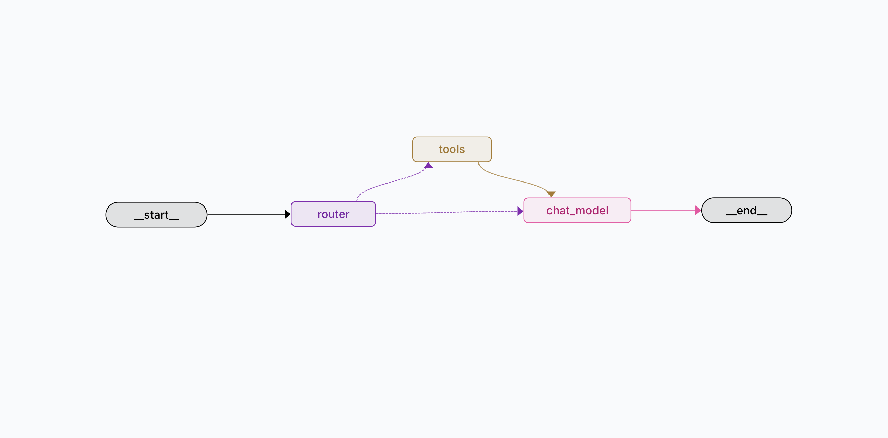

# AI Techtree Agent System

> 이 문서는 AI TechTree Agent의 발전 과정과 방향을 정리한 글입니다. 

---

## 🔴 v1.0: MCP Chatbot (Stateless)
> 초기 버전은 정의한 **MCP(Model Context Protocol)** 도구를 활용하여 정확한 정보를 제공하는 데 집중합니다.
1.  **Stateless Interaction**: 모든 쿼리를 독립적인 요청으로 처리하며, 사용자의 숙련도(Mastery)를 기억하지 않음.
2.  **Tool Usage**: `Tavily Search`나 `Vector Embedding`를 사용하여 답변을 검색.
3.  **Simple Routing**: "Search"와 "Chat" 의도를 단순 구분하여 처리.

> 사용자 입력에 따라 정의된 Tool을 선택하여 실행합니다. 
- **agent_router**: AI Router Agent가 사용자 요청의 의도를 분류하여 도구를 실행 및 결과 반환.
- **agent_tools**: LLM 또는 MCP Tool을 직접 호출하여 결과를 반환.

    - **get_techtree_survey**: 사용자의 개발 연차와 관심 분야를 파악하기 위한 성향 진단 설문 생성.
    - **get_techtree_track**: 관심 키워드와 경력 수준을 분석하여 최적의 AI 커리어 트랙 추천.
    - **get_techtree_path**: 선택한 트랙의 전체 단계별 학습 로드맵 및 커리큘럼 구성 조회.
    - **get_techtree_subject**: 특정 과목(주제)에서 학습해야 할 상세 개념과 수준별 지식 제공.
    - **get_techtree_trend**: 최신 기술 뉴스, 블로그, 논문을 검색하여 실시간 AI 트렌드 정보 제공.

---

## 🔴 v1.1: Keyword-Driven Personalized Agent (Stateful)
> LangGraph를 도입하여 에이전트의 사고 과정을 고도화하고, User ID 기반의 영속적 상태 관리를 통해 사용자 수행 기록을 관리합니다.

- **Stateful Persistence** : 사용자가 입력한 `고유 ID`를 키값으로 `MongoDB`와 연동하여, 획득한 별(Star), 학습한 키워드 상태를 영구적으로 유지
- **Graph-based Workflow** : '키워드 탐색 → 퀴즈 생성 → 답변 평가 → 성취도 업데이트'의 워크플로우를 LangGraph 상태 구조로 제어.
- **Gamification Logic**: 사용자의 답변 질에 따라 별(1~3개)을 부여하며, 임베딩 유사도를 기반으로 학습한 키워드들을 시각적 테크트리 지도로 배치.
- **Observability & Alerting**: 시스템 에러 및 사용자 로그인 이벤트를 Telegram API(Port 443)를 통해 실시간으로 전송하여 운영 안정성을 확보.

> LangGraph workflow : router에서 의도를 분석하여 퀴즈 진행 시 진행 상황에 맞춰 다음 노드로 이동합니다.
*   **router_node**: 사용자 메시지의 의도를 분류하거나 퀴즈 진행 상태에 따라 강제 라우팅 수행.
*   **search_keyword_node**: DB에서 키워드 정의를 조회하거나 생성하여 핵심 개념 가이드 제공.
*   **generate_quiz_node**: 현재 수준에 맞는 맞춤형 퀴즈를 생성하고 학습 세션을 활성화.
*   **answer_quiz_node**: 사용자의 답변을 `perfect/pass/fail`로 정밀 채점하고 피드백 생성.
*   **report_star_node**: 최종 성취도(별점)를 계산하여 MongoDB에 영구 저장하고 학습 리포트 발행.
*   **recommend_keyword_node**: 임베딩 유사도 기반으로 현재 대화와 연관된 다음 학습 키워드 제안.
*   **chit_chat_node**: 학습 흐름과 관계없는 일반 대화나 인사말에 유연하게 대응.
*   **state.py**: 전체 워크플로우를 관통하는 통합 상태 객체(`KeywordState`) 관리.

