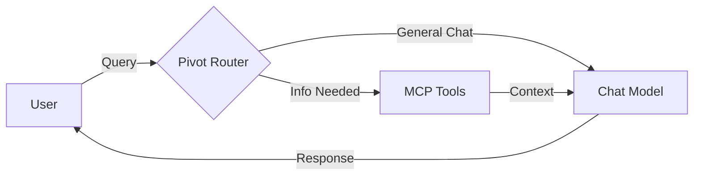
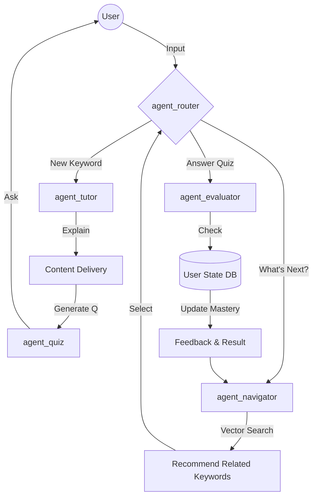
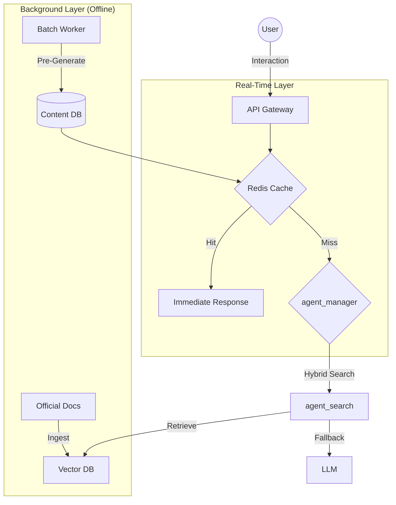

# AI Agent System Evolution Strategy

이 문서는 AI TechTree Agent의 진화 로드맵을 정의하며, 단순 챗봇에서 키워드 기반의 동적 학습 플랫폼으로 변화하는 과정을 설명합니다.

---

## v1.0: MCP Chatbot (Stateless)
> **"The Knowledge Retriever"**

초기 버전은 **MCP(Model Context Protocol)** 도구를 활용하여 정확한 정보를 제공하는 데 집중합니다. 기술 문서나 데이터를 검색하는 스마트 인터페이스 역할을 수행합니다.

### 🎯 Key Features
1.  **Stateless Interaction**: 모든 쿼리를 독립적인 요청으로 처리합니다. 사용자의 숙련도(Mastery)를 기억하지 않습니다.
2.  **Tool Usage**: `Tavily Search`나 `Vector Store`를 사용하여 답변을 검색합니다.
3.  **Simple Routing**: "Search"와 "Chat" 의도를 단순 구분하여 처리합니다.

### 🏗️ Agent Roles (v1.0)
*   **agent_router.py**: 단순 키워드 매칭 (예: 입력에 "search"가 포함되면 Tool 호출)을 수행합니다.
*   **agent_tools.py**: LLM 또는 MCP Tool을 직접 호출하여 결과를 반환합니다.

### 🕸️ Architecture Diagram

---

## v1.1: Keyword-Driven AI Tutor (Current)
> **"The Semantic Navigator"**

v1.1에서는 시스템이 **Stateful Learning Agent**로 진화합니다. 고정된 정적 트리(Static Tree) 구조에서 벗어나, 키워드(Keyword) 중심의 **Dynamic Semantic Network**를 구축합니다.

### 🎯 Key Features
1.  **Keyword-Centric**: 학습의 최소 단위(Atomic Unit)가 "Keyword" (예: "Docker", "BFS")가 됩니다.
2.  **State Management**: 각 Keyword별로 사용자의 숙련도(Mastery, Level 0-5)를 추적하고 저장합니다.
3.  **Active Learning Loop**: Explain(설명) -> Quiz(문제) -> Evaluate(평가) -> Feedback(피드백)의 순환 과정을 거칩니다.
4.  **Semantic Navigation**: 하드코딩된 순서가 아닌, **Vector Similarity(벡터 유사도)**를 기반으로 다음 학습 단계를 추천합니다.

### 🏗️ Agent Roles (v1.1)
*   **agent_router.py**: 사용자 의도를 `Keyword Search`, `Answer` (Quiz), `Navigation` 등으로 분류합니다.
*   **agent_tutor.py**: 키워드에 대한 **개념 설명(Definition & Summary)**을 생성합니다. (기존 content_generator)
*   **agent_evaluator.py**: 사용자의 답변을 채점하고 **피드백(Feedback)**을 제공합니다.
*   **agent_quiz.py**: 특정 키워드에 최적화된 **면접 질문(Question & Model Answer)**을 생성합니다. (기존 question_creation)
*   **agent_navigator.py**: 벡터 유사도를 기반으로 **다음 학습할 키워드**를 추천합니다.

### 🕸️ Architecture Diagram

---

## v1.2: Optimization & Scale (Planned)
> **"The Adaptive Platform"**

v1.2는 대규모 트래픽에서의 **Performance**, **Cost Efficiency**, 그리고 **Personalization**에 초점을 맞춥니다. **RAG(Retrieval-Augmented Generation)**와 **Offline Processing(오프라인 처리)**를 도입하여 레이턴시(Latency)와 LLM 비용을 절감합니다.

### 🎯 Key Features
1.  **Offline Batch Processing**:
    *   트래픽이 적은 시간대에 **Batch API**를 사용하여 "Keyword Content"와 "Question Banks"를 미리 생성(Pre-generate)합니다.
    *   고품질의 설명을 DB에 저장해두어 실시간 생성 지연을 방지합니다.
2.  **RAG-Enhanced Reliability**:
    *   단순 LLM 환각(Hallucination) 대신, 신뢰할 수 있는 **Official Docs(공식 문서)**에서 정의를 검색(Retrieve)하여 정확도를 높입니다.
3.  **Dynamic Cluster Tracks**:
    *   학습된 Keyword들을 자동으로 그룹화(Clustering)하여 "Cluster" (예: "Backend Basics") 단위로 시각화합니다.

### 🏗️ Agent Roles (v1.2)
*   **agent_manager.py**: DB 캐시 확인 및 Batch Job 스케줄링을 관리합니다.
*   **agent_search.py**: `Keyword Search` (Exact)와 `Vector Search` (Semantic)를 결합한 하이브리드 검색을 수행합니다.
*   **agent_ui.py**: 프론트엔드 UI 제어를 위한 JSON 명령(예: `SHOW_CONFETTI`)을 생성합니다.

### 🕸️ Architecture Diagram
