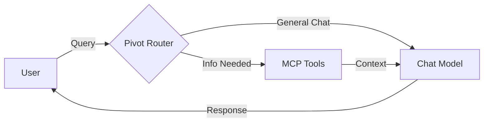
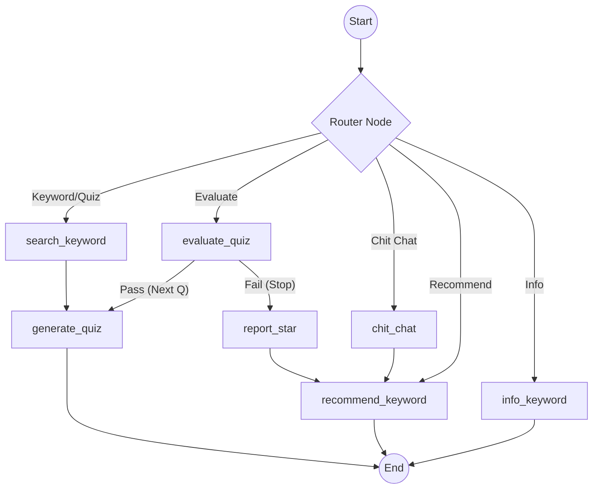
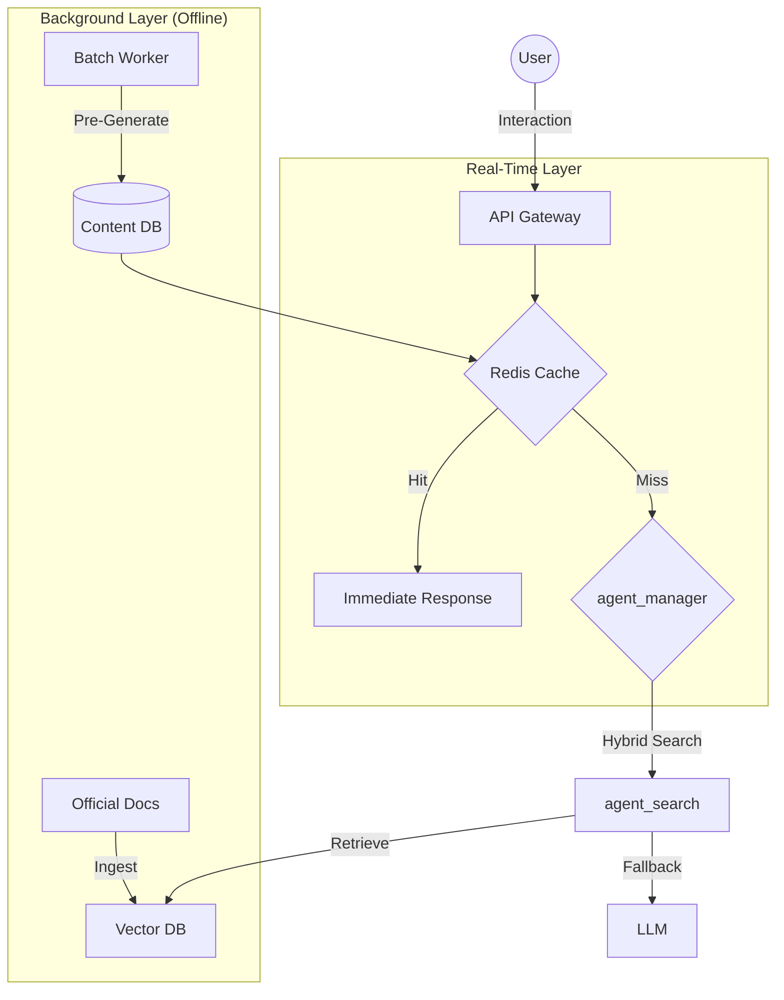

# AI Agent System Evolution Strategy

이 문서는 AI TechTree Agent의 진화 로드맵을 정의하며, 단순 챗봇에서 키워드 기반의 동적 학습 플랫폼으로 변화하는 과정을 설명합니다.

---

## v1.0: MCP Chatbot (Stateless)
> **"The Knowledge Retriever"**

> 초기 버전은 **MCP(Model Context Protocol)** 도구를 활용하여 정확한 정보를 제공하는 데 집중합니다. 기술 문서나 데이터를 검색하는 스마트 인터페이스 역할을 수행합니다.

### 🎯 Key Features
1.  **Stateless Interaction**: 모든 쿼리를 독립적인 요청으로 처리하며, 사용자의 숙련도(Mastery)를 기억하지 않음.
2.  **Tool Usage**: `Tavily Search`나 `Vector Embedding`를 사용하여 답변을 검색.
3.  **Simple Routing**: "Search"와 "Chat" 의도를 단순 구분하여 처리.

### 🏗️ Agent Roles (v1.0)
*   **agent_router.py**: 단순 키워드 매칭 (예: 입력에 "search"가 포함되면 Tool 호출)을 수행.
*   **agent_tools.py**: LLM 또는 MCP Tool을 직접 호출하여 결과를 반환.

### 🕸️ Architecture Diagram

---

## v1.1: Keyword-Driven & Personalized TechTree
> **"My Own TechTree"**

> v1.1에서는 시스템이 **Stateful Learning Agent**로 진화합니다. 기존의 정해진 커리큘럼(Track)을 따르는 것이 아니라, 사용자가 원하는 **키워드(Keyword)** 를 중심으로 스스로 탐험하고 성취하는 **나만의 테크트리**를 구축합니다.

### 🎯 Key Features
1. **Keyword-Based Challenge**
    * 사용자가 원하는 기술 키워드(예: "Docker")를 선택하면,
    * 에이전트가 해당 개념을 설명하고 퀴즈를 출제.
2. **Interactive Quiz & Evaluation**
    * Quiz: 개념 이해도를 확인하기 위한 맞춤형 문제가 생성.
    * Evaluation: 사용자의 답변을 분석하여 즉각적인 피드백을 제공.
3. **Star Rating System**
    * 퀴즈 통과 및 답변의 질에 따라 각 키워드 별로 **별(1-3개)** 을 부여.
    * 별이 모여 레벨 업(Level Up)을 달성하는 게이미피케이션 요소가 도입.
4. **Visualized TechTree**
    * 학습하고 성취한 키워드들은 **Embedding Similarity(임베딩 유사도)** 를 기준으로 시각적으로 배치.
    * 나의 학습 경로가 하나의 거대한 "TechTree" 지도로 형성.

### 🏗️ Agent Roles (v1.1 Refactored)
> 구조적 유연성을 위해 기능별로 에이전트(모듈)를 분리.

* agent_router.py: 
    * 사용자 의도를 `Keyword Search`, `Quiz Answer`, `Chit-Chat` 등으로 분류하여 적절한 노드로 연결.
* agent_keyword.py:
    * Search: 키워드에 대한 기본 개념(Definition & Summary)을 DB에서 조회하거나 생성.
    * Recommend: 현재 학습한 내용과 유사한 다음 키워드를 추천.
    * Info: 키워드와 관련된 추가 정보나 트렌드를 제공.
* agent_quiz.py:
    * Generate: 키워드 기반의 퀴즈를 생성.
    * Evaluate: 사용자의 답변을 채점하고 피드백을 제공.
    * Report: 결과에 따라 별(Star)을 부여하고 성취도를 업데이트.
* agent_chat.py: 학습 외의 일반적인 대화(Chit-Chat)를 처리.
* state.py: 그래프 전체에서 공유되는 `KeywordState`를 정의.

### 🕸️ Architecture Diagram (Graph Flow)

---

## v1.2: Optimization & Scale (Planned)
> **"The Adaptive Platform"**

> v1.2는 대규모 트래픽에서의 **Performance**, **Cost Efficiency**, **Personalization**에 초점을 맞추고, **RAG(Retrieval-Augmented Generation)**와 **Offline Processing(오프라인 처리)**를 도입하여 레이턴시(Latency)와 LLM 비용을 절감.

### 🎯 Key Features
1.  **Offline Batch Processing**:
    *   트래픽이 적은 시간대에 **Batch API**를 사용하여 "Keyword Content"와 "Question Banks"를 미리 생성(Pre-generate).
    *   고품질의 설명을 DB에 저장해두어 실시간 생성 지연을 방지.
2.  **RAG-Enhanced Reliability**:
    *   단순 LLM 환각(Hallucination) 대신, 신뢰할 수 있는 **Official Docs(공식 문서)**에서 정의를 검색(Retrieve)하여 정확도를 높.
3.  **Dynamic Cluster Tracks**:
    *   학습된 Keyword들을 자동으로 그룹화(Clustering)하여 "Cluster" (예: "Backend Basics") 단위로 시각화.

### 🏗️ Agent Roles (v1.2)
*   **agent_manager.py**: DB 캐시 확인 및 Batch Job 스케줄링을 관리.
*   **agent_search.py**: `Keyword Search` (Exact)와 `Vector Search` (Semantic)를 결합한 하이브리드 검색을 수행.
*   **agent_ui.py**: 프론트엔드 UI 제어를 위한 JSON 명령(예: `SHOW_CONFETTI`)을 생성.

### 🕸️ Architecture Diagram
