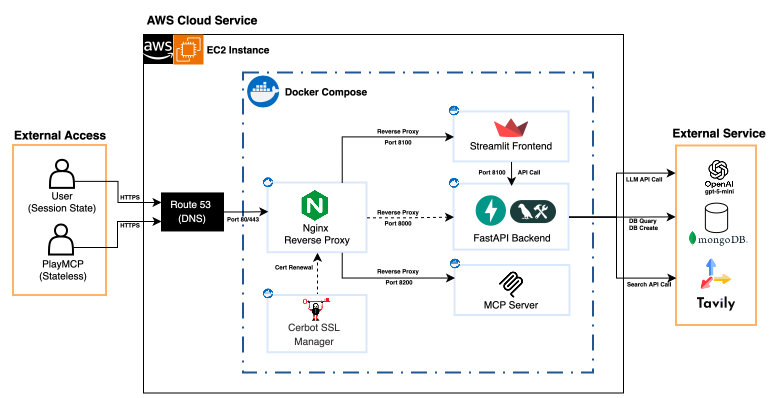

# AI TechTree System Architecture
> 이 문서는 버전별 배포 아키텍처를 정리한 글입니다.

## 🔴 v1.0.0 (2026-01-15)
> Stateful LangChain Agent Architecture
- Streamlit의 Session State를 활용한 메모리 기반 상태 유지 
- LangChain의 tool Call(도구 정의 및 호출) 기능을 활용한 AI 에이전트 구조
> Stateless MCP Server
- 사용자 관심사 진단 및 AI 직무 트랙 추천을 위한 Stateless 아키텍처
- 독립적인 MCP 서버를 통한 검색 및 추천 도구 통합 관리 (Kakao PlayMCP 연동)

## 🔴 v1.1.0 (2026-03-02)
> Stateful LangGraph Multi-Agent workflow Architecture
- 기술 용어 기반의 AI 면접 및 레벨 도전 시스템을 위한 Stateful 아키텍처 
- LangGraph 서버의 자동 checkpointer를 활용한 In-memory 상태 관리
- 입력된 user_id를 기반으로 MongoDB Atlas에 영속성 상태 관리 (진행상황 저장)
- 내부 서비스의 expose 설정을 통해 외부 노출을 차단한 격리된 네트워크 환경 구축 (보안 강화)

