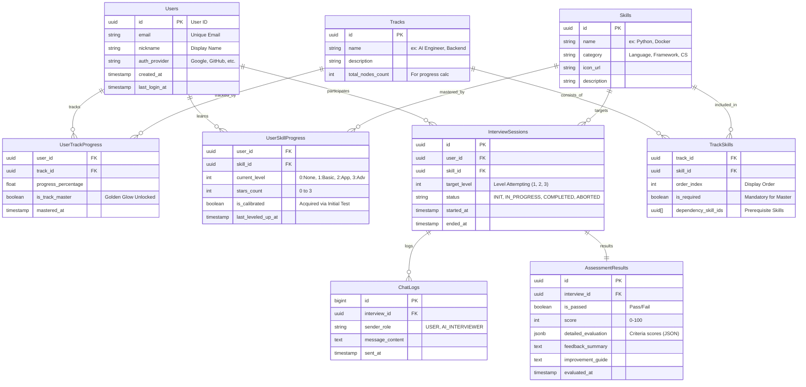

# Database Schema Design

## 1. 개요
본 문서는 "AI TechTree" 프로젝트의 데이터베이스 스키마를 정의합니다.
사용자의 기술 역량을 진단하고 성장 과정을 추적하는 RPG 형태의 서비스를 지원하기 위해 관계형 모델(Relational Model)을 기반으로 설계되었습니다.

## 2. ER Diagram (Entity Relationship)

## 3. 상세 테이블 정의 (Table Definitions)

### 3.1 계정 및 사용자 (Users)
- **Users**: 서비스의 핵심 사용자 정보입니다.

| Field | Type | Description |
|---|---|---|
| id | UUID | Primary Key |
| email | VARCHAR(255) | 이메일 (Unique) |
| nickname | VARCHAR(50) | 닉네임 |
| auth_provider | VARCHAR(20) | 소셜 로그인 제공자 |
| created_at | TIMESTAMP | 계정 생성일 |

### 3.2 메타데이터 (Metadata)
서비스에서 제공하는 트랙과 기술의 정적 정의입니다.

- **Tracks**: 직무 트랙 정보 (예: 'AI Engineer', 'Backend Developer')
- **Skills**: 개별 기술 노드 (예: 'Python', 'Docker', 'FastAPI')
- **TrackSkills**: 트랙 내 스킬의 구성 및 순서, 선행 조건(Dependency)을 정의합니다.

### 3.3 사용자 성장 데이터 (User Progress)
사용자의 현재 학습 상태와 성취를 기록합니다.

- **UserSkillProgress**
  - 사용자가 특정 `Skill`에 대해 도달한 레벨(Stars)을 저장합니다.
  - `current_level`: 
    - 0: 미획득 (Locked)
    - 1: 기초 (Basic, ⭐)
    - 2: 응용 (Applied, ⭐⭐)
    - 3: 심화 (Advanced, ⭐⭐⭐)
  - `is_calibrated`: 배치고사를 통해 한 번에 획득한 레벨인지 여부.

- **UserTrackProgress**
  - 사용자의 트랙별 진행률과 마스터(Golden Glow) 여부를 저장합니다.
  - `is_track_master`: 트랙 마스터 챌린지 성공 시 True.

### 3.4 인터뷰 및 평가 (Interview & Assessment)
AI 에이전트와의 면접 세션 데이터입니다.

- **InterviewSessions**: 면접 세션의 메타 정보 (누가, 어떤 기술을, 몇 레벨로 도전했는지).
- **ChatLogs**: 면접 중 오고 간 대화 내용. (추후 RAG나 복습 기능에 활용)
- **AssessmentResults**: 면접 종료 후 생성된 평가 리포트.
  - `detailed_evaluation`: JSON 형태로 저장된 세부 항목별 점수.
  - `feedback_summary`: AI가 제공한 총평.
  - `improvement_guide`: 부족한 점에 대한 학습 가이드.
