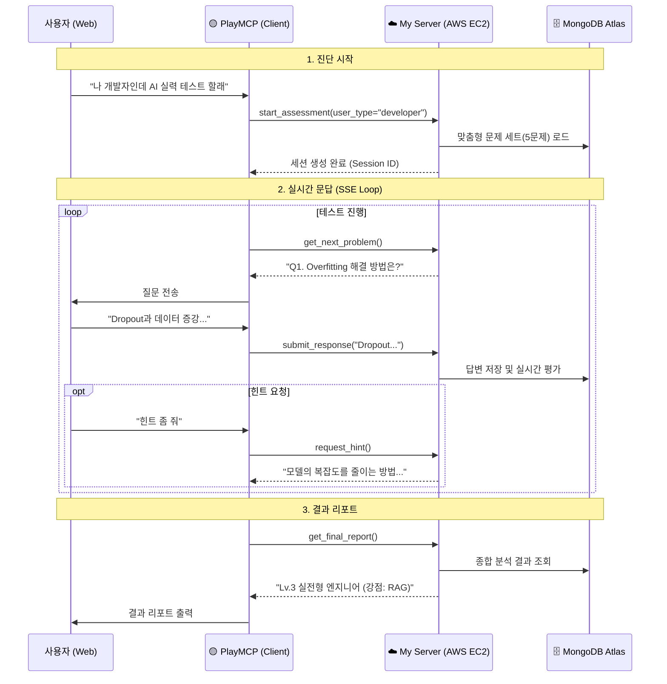

# TechTree Nexus: Kakao PlayMCP Edition

> **Target**: Kakao MCP Player 10 Contest  
> **Concept**: PlayMCP 채팅창에서 만나는 **"내 손안의 AI 기술 면접관"**

## 1. 아키텍처 (어떻게 연결되는가?)

사용자는 내가 만든 서버에 직접 접속하지 않습니다. **PlayMCP**가 중간 다리가 되어줍니다.

---

## 2. PlayMCP 연동 필수 조건

PlayMCP 서버가 내 서버를 호출할 수 있어야 하므로, **공개된 인터넷 주소**가 필수입니다.

1.  **통신 방식**: `SSE (Server-Sent Events)` over HTTP
    *   로컬 전용(`stdio`)이 아닌 **웹 서버 모드**로 띄워야 함.
2.  **엔드포인트**:
    *   `http://{MY_PUBLIC_IP}:8000/sse` (MCP 접속 주소)
    *   `http://{MY_PUBLIC_IP}:8000/messages` (메시지 처리)
3.  **배포 환경**:
    *   **AWS EC2** (t2.micro) 사용.
    *   **Public IP** 할당 필수 (PlayMCP가 접속해야 하므로).

---

## 3. 핵심 도구 (MCP Tools)

PlayMCP 채팅창에서 AI가 자동으로 호출할 함수들입니다.

### 🟡 진단 시작하기 (`start_assessment`)
*   **설명**: 사용자의 **전공/관심사(Persona)**를 입력받아 종합 레벨 테스트를 시작합니다.
*   **입력**: `user_type` (한국어 입력 지원: '일반인', '학생', '개발자', 'AI 연구원' 등)
*   **기능**: 입력된 한국어 키워드를 내부적으로 매핑하여, 해당 유형에 맞는 **맞춤형 문제 세트**를 DB에서 로드하고 세션을 엽니다.

### 🟡 문제 출제하기 (`get_next_problem`)
*   **기능**: 다음 순서의 문제를 가져옵니다.
*   **특징**: 단순 지식형 문제뿐만 아니라, **상황 판단형** 문제를 섞어서 출제합니다.

### 🟡 힌트 요청하기 (`request_hint`)
*   **설명**: 문제 해결이 어려울 때 힌트를 요청합니다.
*   **기능**: 정답을 바로 알려주지 않고, **생각의 방향을 유도하는 가이드**를 제공합니다. (힌트 사용 시 획득 점수 소폭 차감)

### 🟡 답안 제출하기 (`submit_response`)
*   **기능**: 사용자의 답변을 저장하고 즉시 **1차 평가**를 수행합니다.
*   **동적 조절**: 답변 수준이 높으면 다음 문제의 난이도를 높이는(Adaptive) 로직을 포함할 수 있습니다.

### 🟡 진행 상황 확인 (`get_progress`)
*   **설명**: 현재 테스트 진행도와 남은 문제 수를 확인합니다.
*   **출력**: "현재 3/5 문제를 풀고 계십니다. (진행률 60%)"

### 🟡 결과 조회하기 (`get_final_report`)
*   **기능**: 테스트 종료 후 **종합 등급(Level)**과 **강점/약점 피드백**을 반환합니다.

---

## 4. 최종 목표 (시나리오)

> **심사위원**: "나 AI 개발자 실력 테스트 해볼래."
>
> **TechTree(AI)**: "네, 알겠습니다. **[개발자(Developer)]** 코스로 종합 진단을 시작합니다.
> 첫 번째 질문입니다. **Overfitting(과적합)이 발생했을 때 해결할 수 있는 방법**을 3가지 이상 말해보세요."
>
> **심사위원**: "데이터 추가, Dropout 사용, 모델 복잡도 줄이기..."
>
> **TechTree(AI)**: "정확합니다. 모델링의 기본을 잘 아시네요.
> 그럼 심화 문제입니다. **RAG 시스템에서 할루시네이션을 줄이기 위한 프롬프트 기법**은 무엇이 있을까요?"
>
> *(테스트 종료 후)*
>
> **TechTree(AI)**: "수고하셨습니다! 당신의 레벨은 **[Lv.3 실전형 AI 엔지니어]**입니다. RAG와 최적화에 강점이 있으시군요."

---

## 5. 개발 체크리스트

- [ ] **Data Layer**: MongoDB Atlas 클러스터 생성 및 연결 (`backend/.env`).
- [ ] `FastAPI`로 웹 서버 띄우기 (SSE 지원).
- [ ] AWS EC2 보안 그룹에서 **8000번 포트 개방**.
- [ ] PlayMCP 개발자 센터에 내 서버 URL (`http://.../sse`) 등록.
