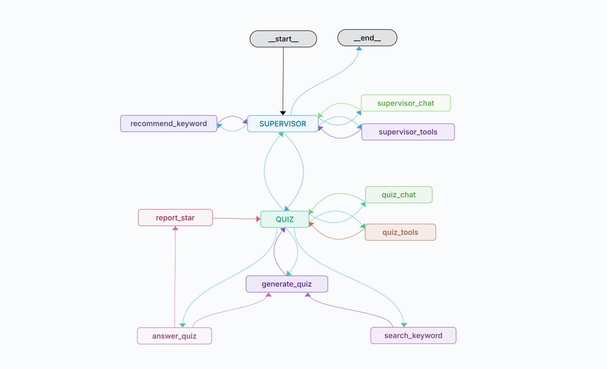
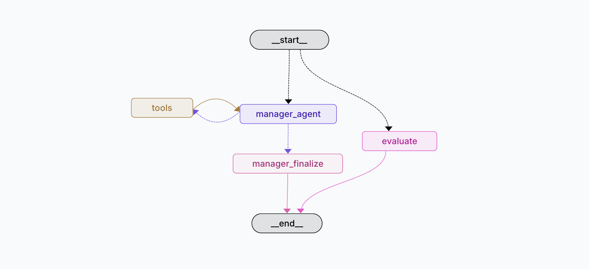
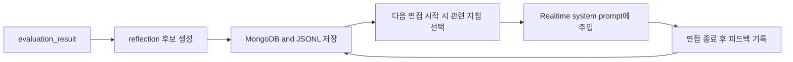

# TechTree Agent System

> 이 문서는 TechTree Agent의 발전 과정과 방향을 정리한 글입니다. 

---

## 🔴 v1.0: MCP Chatbot (Stateless)
> 초기 버전은 정의한 **MCP(Model Context Protocol)** 도구를 활용하여 정확한 정보를 제공하는 데 집중합니다.
1.  **Stateless Interaction**: 모든 쿼리를 독립적인 요청으로 처리하며, 사용자의 숙련도(Mastery)를 기억하지 않음.
2.  **Tool Usage**: `Tavily Search`나 `Vector Embedding`를 사용하여 답변을 검색.
3.  **Simple Routing**: "Search"와 "Chat" 의도를 단순 구분하여 처리.

> 사용자 입력에 따라 정의된 Tool을 선택하여 실행합니다. 
- **agent_router**: AI Router Agent가 사용자 요청의 의도를 분류하여 도구를 실행 및 결과 반환.
- **agent_tools**: LLM 또는 MCP Tool을 직접 호출하여 결과를 반환.

    - **get_techtree_survey**: 사용자의 개발 연차와 관심 분야를 파악하기 위한 성향 진단 설문 생성.
    - **get_techtree_track**: 관심 키워드와 경력 수준을 분석하여 최적의 AI 커리어 트랙 추천.
    - **get_techtree_path**: 선택한 트랙의 전체 단계별 학습 로드맵 및 커리큘럼 구성 조회.
    - **get_techtree_subject**: 특정 과목(주제)에서 학습해야 할 상세 개념과 수준별 지식 제공.
    - **get_techtree_trend**: 최신 기술 뉴스, 블로그, 논문을 검색하여 실시간 AI 트렌드 정보 제공.

---

## 🔴 v1.1: Keyword-Driven Personalized Agent (Stateful)
> LangGraph를 도입하여 에이전트의 사고 과정을 고도화하고, User ID 기반의 영속적 상태 관리를 통해 사용자 수행 기록을 관리합니다.

- **Stateful Persistence** : 사용자가 입력한 `고유 ID`를 키값으로 `MongoDB`와 연동하여, 획득한 별(Star), 학습한 키워드 상태를 영구적으로 유지
- **Graph-based Workflow** : '키워드 탐색 → 퀴즈 생성 → 답변 평가 → 성취도 업데이트'의 워크플로우를 LangGraph 상태 구조로 제어.
- **Gamification Logic**: 사용자의 답변 질에 따라 별(1~3개)을 부여하며, 임베딩 유사도를 기반으로 학습한 키워드들을 시각적 테크트리 지도로 배치.
- **Observability & Alerting**: 시스템 에러 및 사용자 로그인 이벤트를 Telegram API(Port 443)를 통해 실시간으로 전송하여 운영 안정성을 확보.

> LangGraph workflow : router에서 의도를 분석하여 퀴즈 진행 시 진행 상황에 맞춰 다음 노드로 이동합니다.
*   **router_node**: 사용자 메시지의 의도를 분류하거나 퀴즈 진행 상태에 따라 강제 라우팅 수행.
*   **search_keyword_node**: DB에서 키워드 정의를 조회하거나 생성하여 핵심 개념 가이드 제공.
*   **generate_quiz_node**: 현재 수준에 맞는 맞춤형 퀴즈를 생성하고 학습 세션을 활성화.
*   **answer_quiz_node**: 사용자의 답변을 `perfect/pass/fail`로 정밀 채점하고 피드백 생성.
*   **report_star_node**: 최종 성취도(별점)를 계산하여 MongoDB에 영구 저장하고 학습 리포트 발행.
*   **recommend_keyword_node**: 임베딩 유사도 기반으로 현재 대화와 연관된 다음 학습 키워드 제안.
*   **chit_chat_node**: 학습 흐름과 관계없는 일반 대화나 인사말에 유연하게 대응.
*   **state.py**: 전체 워크플로우를 관통하는 통합 상태 객체(`KeywordState`) 관리.

## ⚪ v1.1.1(lab): Next.js Migration & Orchestration Test
> 프론트엔드 환경을 전환(Streamlit → Next.js)하고, 복잡한 퀴즈 진행을 제어하기 위해 Main-sub Agent 구조를 테스트한 랩(Lab) 버전입니다.
1. **Frontend Migration Test**: 웹 접근성 및 UI 확장을 위해 Streamlit(Python) 환경에서 Next.js(TypeScript)로의 마이그레이션 및 API 연동 테스트.
2. **Main-Sub Orchestration**: 단일 그래프를 넘어 메인 에이전트가 서브 에이전트를 호출하여 퀴즈 진행을 세밀하게 제어하는 워크플로우 확장 시도.
3. **Debug & UI Enhancements**: 에이전트 상태 디버그 페이지 신설, 객관식 퀴즈 선택창 UI 도입 및 퀴즈 진행 중 힌트 제공 노드 추가.

> **한계점 (Limitations)**
- 워크플로우 구조적 복잡도 증가로 인한 답변 지연(Latency) 문제 발생.
- Next.js 페이지 컴포넌트와 백엔드 AI 작동 간의 상태 동기화 및 연결 불완전성.
- v1.1의 구조에서 크게 벗어나지 못해 실시간성이 요구되는 서비스 적용에 한계 확인.

## 🔴 v2.0: AI Voice Mock Interview Engine (Realtime WebRTC)
> v2.0부터 TechTree는 학습/퀴즈 서비스가 아니라 **AI 음성 모의면접 서비스**로 전환했다.  
> 실시간 대화는 OpenAI Realtime WebRTC가 담당하고, LangGraph는 면접 전 컨텍스트 준비와 면접 후 평가 리포트 생성에 집중한다.

- **WebRTC Direct Streaming**: 프론트엔드 브라우저와 OpenAI Realtime API 간의 WebRTC 오디오 직결 구조를 채택하여 음성 대화의 지연 시간(Latency)을 최소화.
- **FastAPI Core Gateway**: 초대코드 인증, 업로드 서류 분석, Realtime client secret 발급, 종료 평가 트리거, 이메일 발송 등 핵심 비즈니스 로직 및 세션 제어를 전담.
- **In-Memory Graph Library**: LangGraph가 독립된 서버가 아닌 FastAPI 내부 라이브러리로 실행되어, 네트워크 오버헤드 없이 고속으로 인터뷰 프롬프트 조립 및 결과 스키마 평가 수행.
- **Prompt Memory Architecture**: 모델 fine-tuning 대신 면접 운영 과정에서 축적된 비식별 교훈(Reflection)과 지침(Policy)을 동적으로 선별하여 시스템 프롬프트에 주입하는 자기개선 루프 구축.
- **Auxiliary Tool Data**: 추천 채용 공고는 리포트의 최종 목적지가 아닌, 면접 컨텍스트 구체화 및 에이전트 도구 실행 기록을 보조하는 데이터로 활용.

> LangGraph는 면접 시작 전의 '준비 상태'와 면접 종료 후의 '평가 상태'를 트리거 조건에 따라 분기하여 제어
- `manager_agent`: 사용자가 제공한 공고/직무 정보가 부족하면 `search_korean_job_postings` 도구 호출을 판단한다.
- `tools`: LangGraph `ToolNode`이며 Tavily 기반 `search_korean_job_postings`를 실행할 수 있다.
- `manager_finalize`: 도구 결과와 사용자 입력을 모아 Realtime 면접관 시스템 프롬프트를 만든다.
- `evaluate`: 면접 전체 transcript(대화 내용)를 구조화 평가 스키마로 분석해 리포트 결과를 만든다.

> Reflection/Policy는 모델을 fine-tuning하는 구조가 아니다. 면접 운영에서 얻은 비식별 교훈을 저장하고 다음 면접 프롬프트에 일부만 주입하는 prompt memory 구조이다.
선택 규칙:

- promoted policy를 최대 3개까지 우선 검색한다.

- 전체 주입 한도는 기본 `limit=5`이다.

- policy와 중복되는 reflection은 제외한다.

- 직무, 경력, 학력, 면접 모드, confidence, outcome, deprecated 여부를 기준으로 필터링한다.

- 모든 reflection이 매번 쓰이는 것이 아니라 현재 면접 조건에 맞는 일부만 사용된다.

- MongoDB Atlas collections:`interview_reflections`, `interview_policies`

