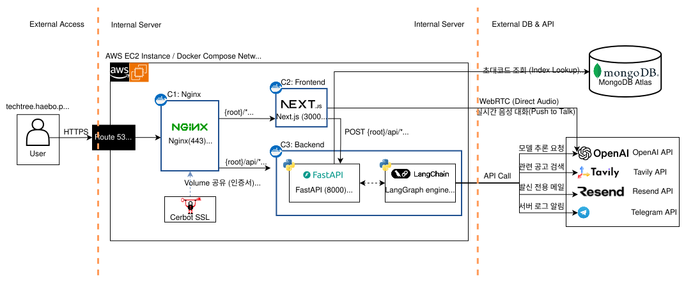

# TechTree System Architecture
> 이 문서는 버전별 배포 아키텍처를 정리한 글입니다.

## 🔴 v1.0.0 (2026-01-15)
> Stateful LangChain Agent Architecture
- Streamlit의 Session State를 활용한 메모리 기반 상태 유지 
- LangChain의 tool Call(도구 정의 및 호출) 기능을 활용한 AI 에이전트 구조
> Stateless MCP Server
- 사용자 관심사 진단 및 AI 직무 트랙 추천을 위한 Stateless 아키텍처
- 독립적인 MCP 서버를 통한 검색 및 추천 도구 통합 관리 (Kakao PlayMCP 연동)

## 🔴 v1.1.0 (2026-03-02)
> Stateful LangGraph Multi-Agent workflow Architecture
- 기술 용어 기반의 AI 면접 및 레벨 도전 시스템을 위한 Stateful 아키텍처 
- LangGraph 서버의 자동 checkpointer를 활용한 In-memory 상태 관리
- 입력된 user_id를 기반으로 MongoDB Atlas에 영속성 상태 관리 (진행상황 저장)
- 내부 서비스의 expose 설정을 통해 외부 노출을 차단한 격리된 네트워크 환경 구축 (보안 강화)

## 🔴 v2.0.0 (2026-05-18)
> Realtime WebRTC Audio & In-Memory AI Engine Architecture
- Next.js 브라우저와 OpenAI Realtime API 간의 WebRTC 직결을 통한 초저지연 Push-to-Talk 음성 면접 구현
- FastAPI 백엔드 프로세스 내에 LangGraph를 라이브러리로 탑재하여 네트워크 지연 없는 고속 인메모리 함수 호출 구조 확립
- Nginx 프록시를 최전방에 배치하여 `{root}/* (UI)`와 `POST {root}/api/* (API)` 경로를 명확히 분기 (3-컨테이너 구조 정립)

> Secure Gatekeeping & Distributed External Cloud Integration
- MongoDB Atlas(`invite_codes` 컬렉션)의 인덱스 조회(Index Lookup)와 HttpOnly 세션 쿠키 기반의 강력한 접근 제어
- 비식별 면접 지침을 Semantic Search 기반의 Reflection/Policy 메모리로 관리하여 차기 세션 시스템 프롬프트에 동적 선별 주입
- Certbot과 Nginx 간의 인증서 볼륨 공유를 통한 무중단 HTTPS 운영 인프라 자동화
- 외부 API 계층(Tavily 공고 검색, Resend 리포트 메일 발송, Telegram 로그 알림)의 호출 파이프라인 중앙 제어

