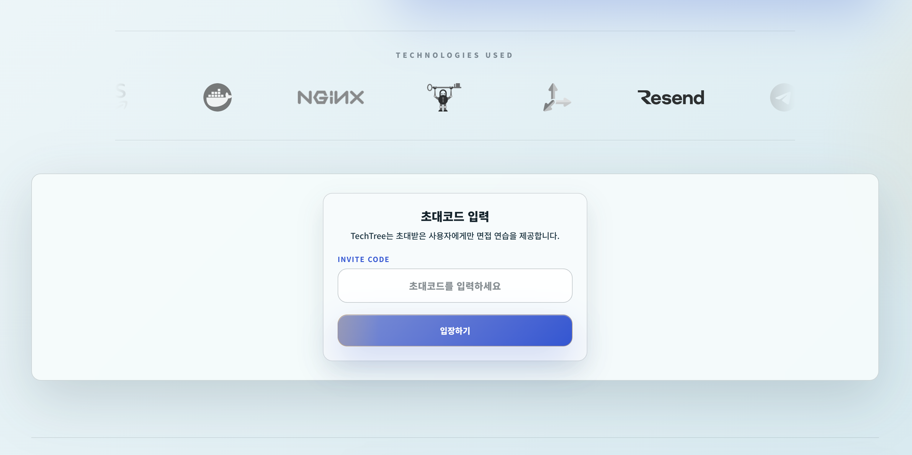
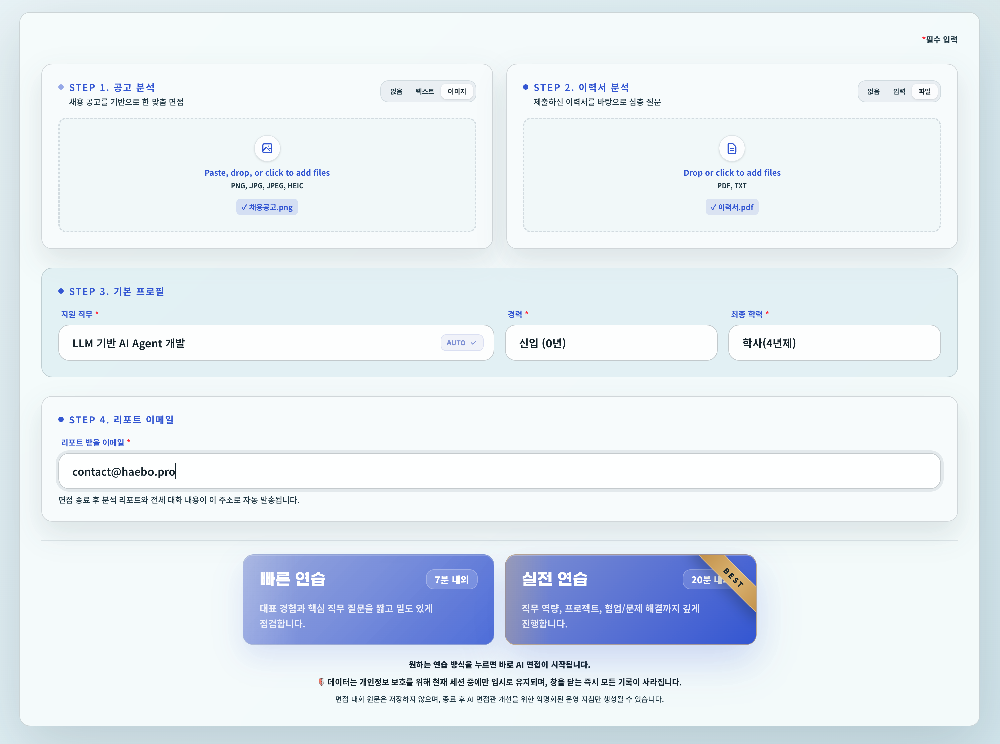
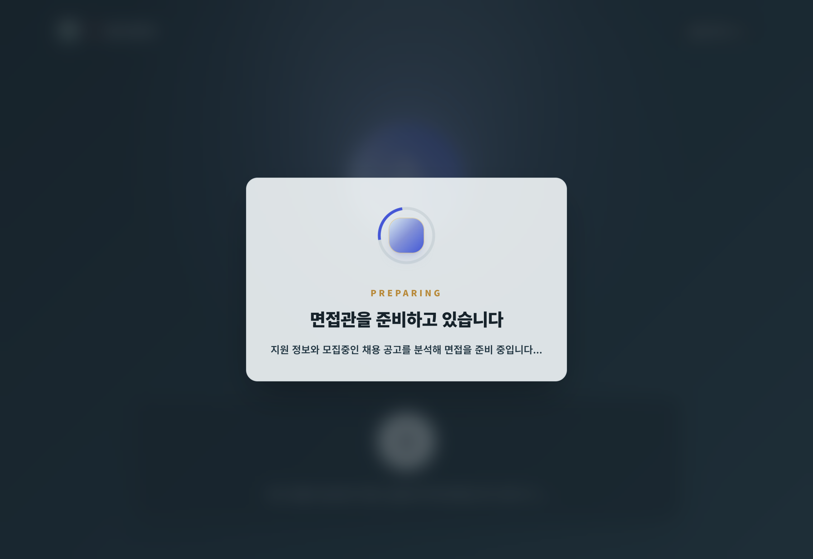
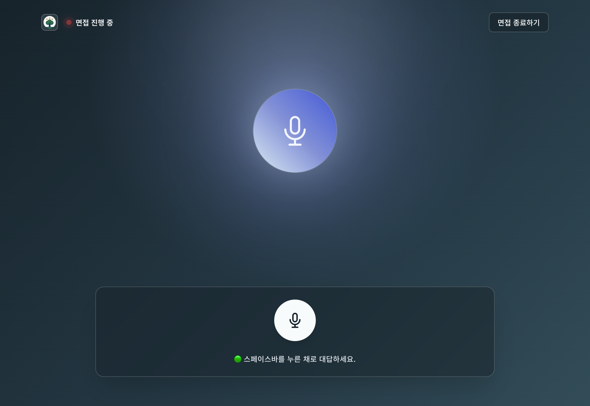
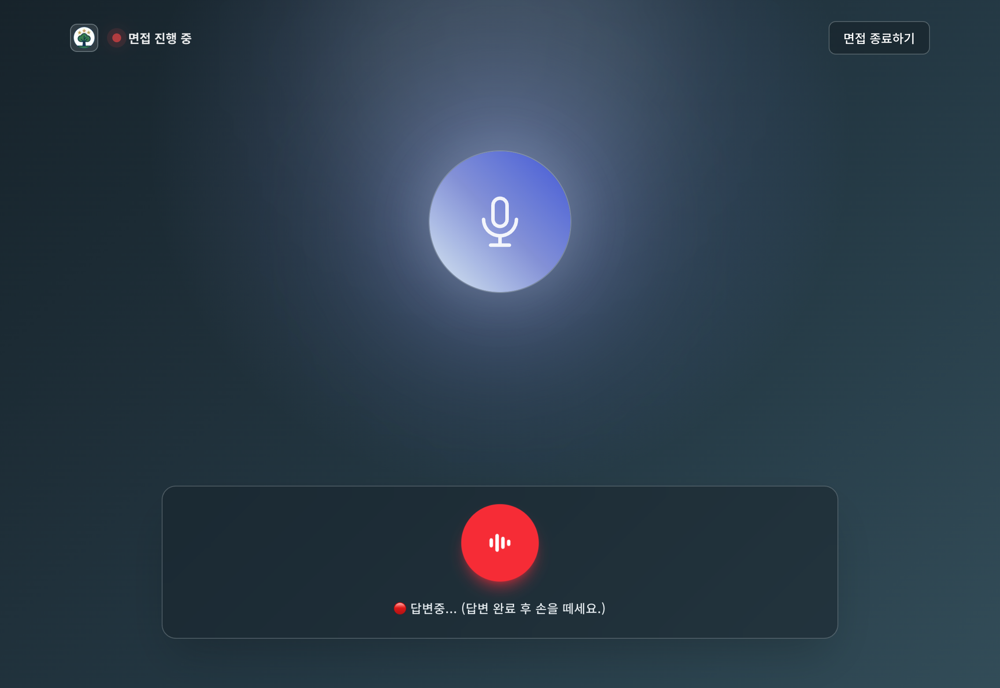
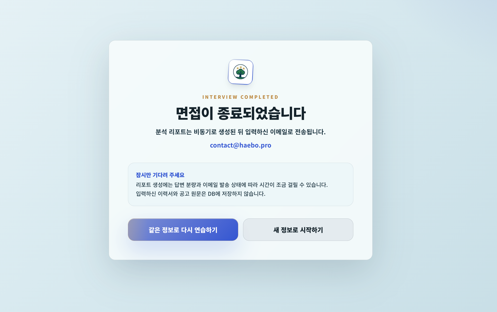
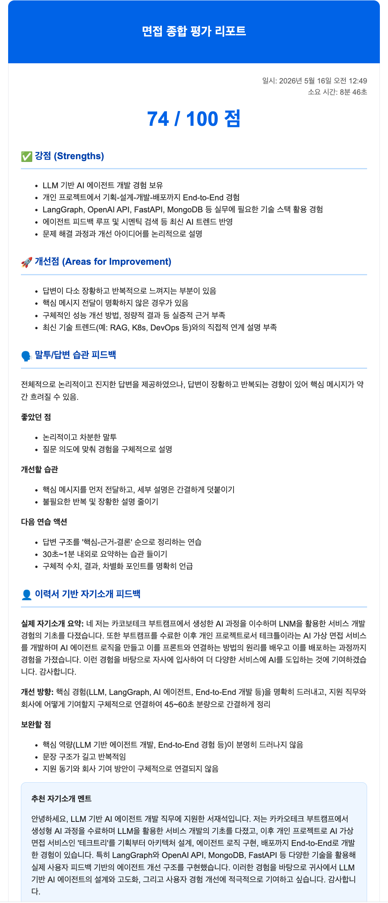
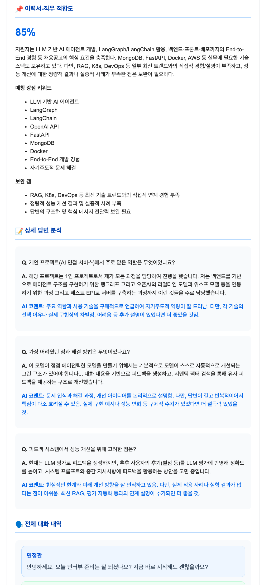
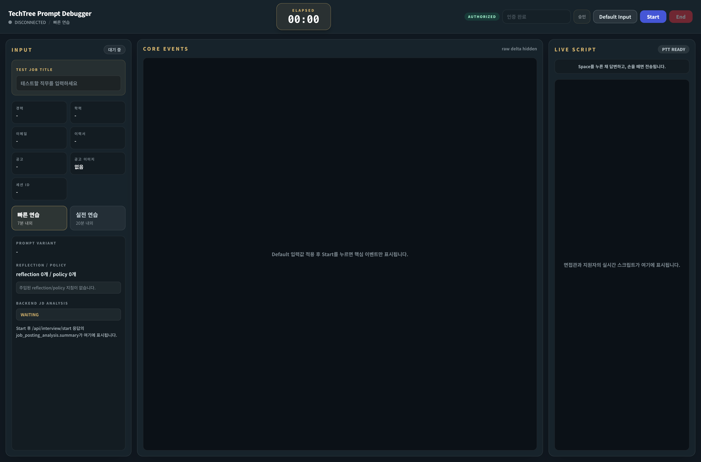

# TechTree Service Screens

> 서비스에 직접 접속하지 않아도 TechTree v2.0의 주요 화면 흐름을 빠르게 확인할 수 있도록 정리한 화면 중심 문서입니다.

## 화면 흐름

| Step | Screen | Description |
| --- | --- | --- |
| 1 | Home | 면접 프로필, 이력서, 채용 공고를 입력하고 AI 면접을 시작합니다. |
| 2 | Interview | OpenAI Realtime WebRTC 기반 음성 면접을 진행합니다. |
| 3 | Complete | 면접 종료 후 비동기 리포트 생성과 이메일 발송 안내를 확인합니다. |
| 4 | Report | legacy/manual 화면에서 점수, 강점, 개선점, 상세 Q&A 피드백을 확인합니다. |
| Dev | Debug | Realtime 연결, 이벤트 로그, transcript 흐름을 개발자가 점검합니다. |

---

## 1. Home
> 초대코드 인증, 지원자 정보, 이력서, 채용 공고, 면접 모드를 입력하는 시작 화면입니다. 페이지 하단에는 홈 화면 전체 캡처 이미지가 있습니다.

---

## 2. Interview

---

## 3. Complete
> 운영 기준의 기본 종료 화면입니다. 사용자는 이 화면에서 리포트가 이메일로 발송된다는 안내를 확인합니다.

---

## 4. Report
> `/result`는 legacy/manual report view입니다. 운영 주 흐름은 `/complete` 이후 이메일 리포트를 확인하는 방식입니다.

<table>
  <tr>
    <td width="50%" valign="top">
      
    </td>
    <td width="50%" valign="top">
      
    </td>
  </tr>
</table>

---

## Developer Debug

> Realtime 세션 연결, 프롬프트, 이벤트 로그, transcript 흐름을 점검하기 위한 개발자용 화면입니다.

---

## Full Home Capture

> 첫 화면의 전체 스크롤 구성을 확인하기 위한 긴 캡처입니다.

