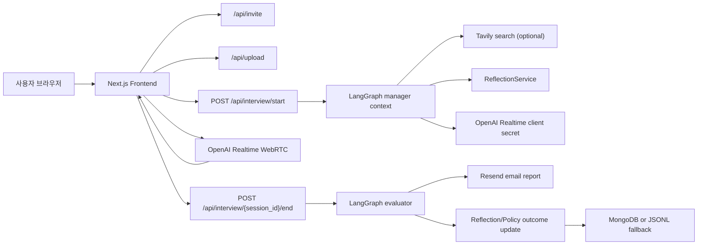

# TechTree Wiki

이 문서는 TechTree의 제품 목적, 시스템 구조, API 흐름, 실시간 음성 면접, 평가 리포트, Reflection/Policy 기반 자기개선, 배포 구조를 한 번에 이해하기 위한 기준 문서이다. 포트폴리오 소개, 운영 인수인계, 신규 개발자 온보딩을 모두 고려해 작성하며, 코드와 문서가 충돌할 때는 현재 런타임 코드와 배포 compose 설정을 우선한다.

## 1. TechTree 개요

TechTree는 이력서와 채용 공고를 바탕으로 실제 대화처럼 진행되는 AI 음성 모의면접 서비스이다. 사용자는 초대코드 인증 후 지원 직무, 경력, 학력, 이력서, 공고 텍스트 또는 이미지를 입력하고, 브라우저에서 Push-to-Talk 방식으로 면접관과 대화한다. 면접 종료 후에는 대화 기록을 기반으로 점수, 강점, 개선점, 상세 Q&A 피드백, 말투/답변 습관, 자기소개 개선 방향이 담긴 리포트가 이메일로 발송된다.

제품의 핵심은 단순한 질문 생성이 아니라 다음 세 가지를 하나의 흐름으로 묶는 것이다.

- 입력 자료를 면접 맥락으로 정리한다.
- OpenAI Realtime WebRTC로 지연이 낮은 음성 면접을 진행한다.
- LangGraph 평가와 Reflection/Policy 메모리를 통해 다음 면접의 운영 지침을 개선한다.

채용 공고 검색과 선별 공고 데이터는 면접 맥락 보강을 위한 보조 데이터이다. 최종 리포트의 핵심 가치는 추천 공고 목록이 아니라 사용자의 실제 답변에 대한 면접 피드백이다.

포트폴리오 관점에서 TechTree v2.0.0은 다음 문제를 해결한 프로젝트이다.

- 실시간 음성 면접에서 자동 VAD가 지원자의 침묵과 사고 시간을 답변 종료로 오해하는 문제를 Space 기반 Push-to-Talk로 제어했다.
- OpenAI Realtime WebRTC는 저지연 대화만 담당하고, LangGraph는 면접 전 컨텍스트 준비와 면접 후 평가만 담당하도록 에이전트 책임 경계를 분리했다.
- 리포트가 그럴듯한 생성문에 머물지 않도록 transcript, 이력서, 사용자 제공 공고와 실제 검색 결과를 평가 입력으로 고정했다.
- 전체 대화 원문을 장기 저장하지 않고 비식별 Reflection/Policy만 축약 저장해 다음 면접의 프롬프트 운영 지침으로 선별 주입했다.
- Next.js, FastAPI, Nginx, Docker Compose, AWS EC2, MongoDB Atlas, Resend를 묶어 실제 도메인에서 접근 가능한 운영 서비스를 구성했다.

## 2. 전체 아키텍처



런타임은 크게 네 계층이다.

- Frontend: Next.js 16 App Router, React 19, Tailwind CSS.
- Backend API: FastAPI, Pydantic schema, invite/session guard, upload analysis, interview API.
- AI Runtime: OpenAI Realtime WebRTC 음성 면접, LangGraph manager/evaluator 워크플로우, LangChain/OpenAI LLM 호출.
- Operations: Docker Compose, Nginx reverse proxy, Certbot HTTPS, AWS EC2 배포, Squarespace DNS와 AWS Elastic IP 기반 도메인 연결.

## 3. 사용자 입력과 초대코드 인증

서비스의 사용자 진입점은 `/`이다. 사용자는 먼저 초대코드를 인증한 뒤 면접 정보를 입력한다.

입력값은 다음과 같다.

- 지원 직무
- 경력
- 최종 학력
- 리포트 받을 이메일
- 이력서 PDF/TXT 또는 직접 입력
- 채용 공고 텍스트 또는 이미지
- 빠른 연습 또는 실전 연습 모드

초대코드 인증은 `/api/invite/session`과 `/api/invite/verify`에서 처리한다. 사용자가 코드를 제출하면 backend는 `MONGODB_URL`로 연결된 MongoDB Atlas에서 `invite_codes` 컬렉션을 조회한다. 운영 기준 컬렉션은 `reflection.invite_codes`이며, `INVITE_DB_NAME=reflection`, `INVITE_COLLECTION_NAME=invite_codes`로 명시할 수 있다. `INVITE_DB_NAME`이 비어 있으면 코드상 `REFLECTION_DB_NAME`을 우선 사용하고, 그 값도 없을 때 `DB_NAME`으로 fallback한다.

인증 조건은 `status=active`이고 `use_count < use_max`인 문서이다. 인증에 성공하면 `use_count`를 1 증가시키고, 서명된 HttpOnly session cookie를 발급한다. 면접 API와 업로드 API는 `require_invite_session` 의존성을 통해 인증된 세션만 허용한다. 따라서 `/api/interview/start`를 직접 호출하더라도 초대 세션이 없으면 `401 Unauthorized`가 발생한다.

초대코드 문서 예시는 다음과 같다.

```json
{
  "code": "TECHTREE-ABCDEFG",
  "name": "haebo",
  "status": "active",
  "use_max": 1,
  "use_count": 0
}
```

## 4. Frontend 화면 흐름

현재 기본 사용자 흐름은 다음과 같다.

1. `/`: 정보 입력, 파일 업로드, 면접 모드 선택.
2. `/interview`: OpenAI Realtime WebRTC 연결, Push-to-Talk 답변, 실시간 면접 진행.
3. `/complete`: 면접 종료 안내, 이메일 리포트 생성 상태 안내.
4. 이메일 리포트: 실제 평가 결과 확인.

`/result`는 로컬 스토리지 기반의 보조/레거시 결과 화면이다. 운영 기준의 주 흐름은 `/complete`와 이메일 리포트 중심이며, 사용자가 최종 평가를 확인하는 기본 채널은 이메일이다.

주요 Frontend 파일은 다음과 같다.

- `frontend/app/page.tsx`: 홈, 입력 폼, 파일 업로드, 서비스 소개.
- `frontend/app/interview/page.tsx`: WebRTC 연결, DataChannel 이벤트 처리, Push-to-Talk, 종료 요청.
- `frontend/app/complete/page.tsx`: 면접 완료 화면.
- `frontend/app/result/page.tsx`: 보조 결과 화면.
- `frontend/app/debug/page.tsx`: 프롬프트와 Realtime 흐름을 점검하는 개발자 디버그 화면.

## 5. Backend API 구조

FastAPI 진입점은 `backend/app/main.py`이며, `/api` 하위에 주요 라우터를 연결한다.

- `/api/invite`: 초대코드 인증과 세션 확인.
- `/api/upload`: 이력서 PDF/TXT 파싱, 채용 공고 텍스트/이미지 분석 보조.
- `/api/interview/start`: 면접 컨텍스트 생성과 OpenAI Realtime client secret 발급.
- `/api/interview/{session_id}/end`: transcript를 받아 평가 리포트 생성을 백그라운드로 시작.
- `/api/interview/{session_id}/email`: 세션의 평가 결과를 이메일로 발송.

면접 API는 `temp_sessions`에 진행 중인 세션의 런타임 상태를 보관한다. 이 구조는 MVP 단계에서 단순하고 빠르지만, 프로세스 재시작 시 세션이 사라진다는 한계가 있다. 운영 고도화 시 세션 영속성을 DB로 옮기는 것이 우선 과제이다.

## 6. 면접 세션 시작 원리

면접 시작은 `POST /api/interview/start`로 시작된다.

1. Frontend가 사용자의 입력값을 backend로 전송한다.
2. Backend가 LangGraph workflow를 호출해 면접 컨텍스트를 만든다.
3. `ReflectionService.select_prompt_guidelines()`가 현재 직무/경력/학력/모드에 맞는 운영 지침을 선별한다.
4. `build_realtime_interviewer_prompt()`가 면접관 시스템 프롬프트를 생성한다.
5. Backend가 OpenAI Realtime `client_secrets` API를 호출해 브라우저용 ephemeral token을 발급한다.
6. Frontend는 이 token으로 OpenAI Realtime WebRTC에 직접 연결한다.

시작 응답에는 `session_id`, `ephemeral_token`, `job_posting_analysis`, `prepared_jobs`, `interview_mode`, `prompt_variant`, `guideline_selection`이 포함된다. `prepared_jobs`는 면접 컨텍스트와 종료 평가 fallback에 쓰이는 실제 공고 데이터이며, 최종 리포트의 핵심 결과나 추천 공고 섹션을 의미하지 않는다.

현재 Realtime 설정은 다음을 기준으로 한다.

- Realtime model: `gpt-realtime-mini-2025-12-15`
- Output modality: `audio`
- Input transcription: `whisper-1`
- Turn detection: disabled
- Voice: 세션 시작 시 후보 voice 중 랜덤 선택

## 7. OpenAI Realtime WebRTC 음성 면접

음성 면접은 브라우저가 OpenAI Realtime에 WebRTC로 직접 연결하는 방식이다. 백엔드는 실시간 오디오를 중계하지 않고, 세션 준비와 종료 평가를 담당한다.

이 구조의 장점은 다음과 같다.

- 브라우저와 OpenAI가 직접 오디오를 주고받아 지연을 줄인다.
- Backend는 장시간 오디오 스트리밍 부하를 떠안지 않는다.
- Frontend는 DataChannel 이벤트를 통해 AI 발화, 사용자 transcription, 응답 완료, 오류를 추적할 수 있다.

Realtime 이벤트는 도착 순서가 완전히 고정되어 있지 않다. 따라서 transcript 저장은 이벤트 타입, item id, 역할, 완료 시점을 방어적으로 다뤄야 한다. 특히 디버그 화면은 “완성된 transcript를 순서대로 확인하는 목적”에 맞게 과도한 시각 효과보다 정확한 입출력 추적을 우선한다.

## 8. Push-to-Talk 설계 이유

TechTree는 자동 음성 감지(VAD)를 기본으로 사용하지 않는다. 사용자는 Space를 누르는 동안만 마이크를 활성화하고, 손을 떼면 `input_audio_buffer.commit`과 `response.create`를 보내 답변을 제출한다.

이 설계는 면접 UX에 맞다.

- 사용자가 답변 시작과 종료 타이밍을 직접 통제한다.
- 주변 소음이나 침묵이 답변으로 잘못 들어갈 가능성을 줄인다.
- 면접관이 말하는 중 사용자의 작은 소리가 끼어드는 문제를 줄인다.
- 디버그와 transcript 정합성 확인이 쉬워진다.

지원자의 특정 발화로 면접을 자동 종료하는 방식은 기본 정책이 아니다. 종료는 면접 종료 버튼과 면접관의 마무리 흐름을 중심으로 처리한다.

## 9. 공고/이력서 분석 흐름

이력서는 PDF/TXT 업로드 또는 직접 입력으로 들어온다. PDF/TXT는 `/api/upload`에서 텍스트로 변환되어 면접 컨텍스트에 포함된다.

채용 공고는 텍스트 또는 이미지로 입력할 수 있다.

- 공고 텍스트가 있으면 그대로 구조화된 면접 맥락으로 사용한다.
- 공고 이미지가 있으면 vision-capable LLM을 통해 회사명, 직무명, 주요업무, 자격요건, 우대사항, 기술스택 등을 요약한다.
- Tavily API 키가 있으면 면접 시작 전 LangGraph manager가 지원 직무 기반 공고를 보조 맥락으로 준비할 수 있다.

이 데이터는 면접관이 더 현실적인 질문을 하도록 돕는 컨텍스트이다. 리포트의 중심은 사용자의 답변 평가이며, 공고 추천을 핵심 결과물로 홍보하지 않는다. evaluator는 가능한 한 사용자 입력 자료와 실제 검색 결과를 사용해야 하며, LLM이 임의의 공고를 만들어내는 흐름은 금지한다.

## 10. LangGraph 평가 리포트 생성

면접 종료 시 Frontend는 `POST /api/interview/{session_id}/end`로 transcript를 보낸다. Backend는 이를 LangChain message 형태로 변환해 LangGraph evaluator에 넘긴다.

평가 워크플로우는 다음 정보를 함께 사용한다. 핵심 원칙은 “평가 문장은 생성하되 평가 근거는 세션 데이터에 고정한다”는 것이다.

- 사용자 프로필: 직무, 경력, 학력
- 이력서 텍스트
- 채용 공고 또는 공고 이미지 분석 요약
- 전체 대화 transcript
- 면접 모드와 면접 운영 가이드
- 세션 시작 시 주입된 Reflection/Policy id

리포트 결과는 다음 항목을 중심으로 구성된다.

- 종합 점수
- 강점
- 개선점
- 상세 답변 분석
- 말투/답변 습관 피드백
- 자기소개 개선 방향
- 직무 적합도
- 전체 대화 내역

이메일 HTML은 `backend/app/api/interview.py`에서 조립되어 Resend로 발송된다. 발송은 백그라운드 작업으로 진행되므로 `/complete` 화면은 “분석 리포트가 비동기로 생성되어 이메일로 발송된다”는 UX를 제공한다. 이 구조는 사용자가 결과 화면 로딩을 기다리는 시간을 줄이는 대신, 운영 고도화 시 리포트 조회/재발송 API가 필요하다는 과제를 남긴다.

## 11. Reflection/Policy 자기개선 구조

TechTree의 자기개선은 모델 파라미터를 학습시키는 fine-tuning이 아니다. 면접 운영에서 얻은 비식별 교훈을 Reflection과 Policy로 저장하고, 다음 세션의 시스템 프롬프트에 선별 주입하는 prompt memory 방식이다.

흐름은 다음과 같다.

1. 면접이 종료되고 평가 결과가 생성된다.
2. `safe_generate_and_store_reflections()`가 대화와 평가 결과를 바탕으로 다음 면접에 재사용할 운영 지침 후보를 만든다.
3. 후보는 raw transcript 원문 저장을 피하고, `prompt_hint`, `issue`, `lesson`, `tags`, `confidence`, `mode_scope` 같은 비식별 운영 메모리로 저장된다.
4. 동일하거나 유사한 지침이 반복적으로 좋은 근거를 얻으면 Policy 후보로 병합/승격된다.
5. 다음 면접 시작 시 `select_prompt_guidelines()`가 현재 프로필과 면접 모드에 맞는 일부 지침만 선별한다.
6. 선별된 지침 id는 세션에 보관되고, 면접 종료 후 해당 지침의 성과가 다시 기록된다.

중요한 점은 모든 reflection이 매번 사용되는 것이 아니라는 것이다. 현재 로직은 promoted policy를 최대 3개까지 우선 검색하고, 전체 주입 한도 `limit=5` 안에서 reflection을 보충한다. 직무, 경력, 학력, 면접 모드, confidence, 긍정/부정 outcome, deprecated 여부를 기준으로 필터링한다. 따라서 한 세션에는 “관련성이 높은 일부 Reflection/Policy”만 들어간다.

이 구조는 서비스 품질을 다음 방향으로 개선한다.

- 짧은 면접과 긴 면접의 운영 습관을 분리한다.
- 특정 직무/경력군에서 반복적으로 유효한 질문 운영법을 재사용한다.
- 좋지 않은 결과를 낸 지침은 outcome 기록을 통해 점수가 낮아지거나 deprecated될 수 있다.
- 원문 대화 전체를 장기 저장하지 않고 운영 지침 중심으로 축약한다.

## 12. MongoDB와 JSONL fallback 저장소

Reflection/Policy 저장소는 두 계층으로 동작한다.

- MongoDB 설정이 있으면 Mongo-backed store를 사용한다.
- MongoDB를 사용할 수 없으면 로컬 JSONL 파일을 fallback으로 사용한다.

이 구조는 로컬 개발과 서버 운영을 모두 지원하기 위한 절충이다. 운영 환경에서는 MongoDB를 사용하는 편이 검색, 백업, 관측성, 서버 재시작 안정성 측면에서 유리하다. JSONL fallback은 개발과 단일 서버 MVP에서 빠르게 실험하기 위한 안전망이다.

## 13. Debug page의 목적

`/debug`는 일반 사용자용 화면이 아니라 프롬프트 반복 실험과 Realtime 흐름 검증을 위한 개발자 도구이다.

디버그 화면에서 중요한 것은 화려한 UI가 아니라 다음 정보를 정확히 보는 것이다.

- 현재 모델에 들어가는 입력값
- 초대코드 인증 상태
- `/api/interview/start` 응답 요약
- 주입된 Reflection/Policy id와 내용
- WebRTC 연결과 DataChannel 이벤트 흐름
- AI/사용자 transcript의 완료 순서
- Push-to-Talk commit과 response 생성 타이밍

다양한 직무에 대한 프롬프트 품질을 점검할 수 있도록 기본 입력값을 빠르게 적용하되, 직무 입력은 수정 가능해야 한다.

## 14. Docker Compose / Nginx / Certbot / AWS 배포 구조

최종 배포 기준은 AWS EC2에서 repository를 clone 또는 pull한 뒤 Docker Compose로 빌드/실행하는 방식이다. 이미지를 로컬에서 빌드해 push하는 방식보다 서버의 현재 소스와 compose 설정을 직접 확인하기 쉬운 구조이다.

현재 배포 구성은 다음과 같다.

- `backend/Dockerfile`: Python 3.12 기반 FastAPI backend 이미지.
- `frontend/Dockerfile`: Node 22 기반 Next.js standalone 이미지.
- `docker-compose.yml`: 운영용 서비스 조합.
- `docker-compose.local.yml`: 로컬 Docker 검증용 조합.
- `docker-compose.bootstrap.yml`: 초기 인증서 부트스트랩 등 보조 목적.
- `nginx/`: reverse proxy 설정.
- `certbot/`: Let’s Encrypt 인증서 발급/갱신용 볼륨 및 설정.

도메인과 고정 IP 연결은 서버 터미널이 아니라 외부 웹 UI에서 설정한다.

- `haebo.pro`: Squarespace에서 구매한 루트 도메인.
- `techtree.haebo.pro`: Squarespace DNS에서 `techtree` A 레코드를 생성해 EC2 Elastic IP를 가리키는 서브도메인.
- Elastic IP: AWS Console에서 생성해 EC2 instance에 연결하는 고정 퍼블릭 IP.
- Security Group: AWS Console에서 `80`, `443`, 제한된 `22` inbound rule을 설정.

운영 서버의 기본 절차는 다음과 같다.

```bash
git clone <repository-url>
cd ai-techtree-project

# backend/.env는 Git에 포함하지 않는다.
# 서버에서 직접 작성하거나 로컬에서 SCP/VS Code로 전송한다.

# 최초 인증서 발급 전에는 HTTP bootstrap으로 먼저 올린다.
docker compose -f docker-compose.yml -f docker-compose.bootstrap.yml up -d --build backend frontend nginx

# HTTP 확인 후 Certbot certonly를 실행한다.
docker compose run --rm --entrypoint certbot certbot certonly \
  --webroot \
  -w /var/www/certbot \
  -d techtree.haebo.pro \
  --email <email@example.com> \
  --agree-tos \
  --no-eff-email

# 인증서 발급 후 운영 HTTPS compose로 전환한다.
docker compose down
docker compose up -d --build
```

Nginx는 외부 80/443 요청을 받아 frontend와 backend로 라우팅한다. HTTPS는 Certbot이 발급한 Let’s Encrypt 인증서를 사용한다. 최초 발급 전에는 nginx가 인증서 파일을 찾지 못할 수 있으므로 bootstrap compose 또는 HTTP-only 설정으로 webroot challenge를 먼저 처리해야 한다.

## 15. 환경 변수와 보안 원칙

`.env`는 Git에 포함하지 않는다. 운영 서버에서는 `backend/.env`를 직접 작성하거나 안전한 방식으로 전송한다.

주요 환경 변수는 다음과 같다.

- `OPENAI_API_KEY`: Realtime session 생성과 평가 LLM 호출.
- `TAVILY_API_KEY`: 선택적 채용 공고 검색.
- `MONGODB_URL`: 선택적 Reflection/Policy 저장소.
- `RESEND_API_KEY`: 이메일 발송.
- `INVITE_DB_NAME`: 초대코드 저장 DB. 운영 권장값은 `reflection`.
- `INVITE_COLLECTION_NAME`: 초대코드 컬렉션. 기본값은 `invite_codes`.
- `INVITE_SESSION_SECRET`: 초대 인증 세션 서명용 secret.
- `TELEGRAM_BOT_TOKEN`, `TELEGRAM_CHAT_ID`: 선택적 운영 알림.

개인정보 처리 원칙은 다음과 같다.

- 이력서와 채용 공고 원문은 필요한 세션 처리에만 사용한다.
- 장기 개선 메모리는 원문 저장보다 비식별 운영 지침 중심으로 축약한다.
- 이메일 리포트는 사용자가 입력한 주소로만 발송한다.
- `.env`, 업로드 원본, 캐시, 인증서 private key는 저장소에 커밋하지 않는다.


## 16. 현재 한계와 향후 개선 방향

현재 TechTree는 MVP 단계에서 핵심 면접 흐름을 끝까지 검증하는 데 초점을 맞춘 구조이다. 이력서/공고 입력, 실시간 음성 면접, 평가 리포트, 이메일 발송, Reflection/Policy 저장까지 하나의 제품 경험으로 연결되어 있지만, 운영 규모 확장과 장기 학습 경험 관점에서는 다음 한계가 남아 있다.

> **현재 한계**

- **면접 경험의 다양성 부족** : 현재 면접관은 하나의 기본 페르소나와 진행 방식에 가깝다. 압박 면접, 온화한 코칭형 면접, 기술 심층 면접, 인성 중심 면접처럼 사용자가 원하는 상황별 연습을 세밀하게 선택하기 어렵다.
- **단일 면접관 중심 흐름** : 실무진과 인사 담당자가 번갈아 질문하는 다대일 면접 구조는 아직 구현되어 있지 않다. 따라서 실제 채용 과정에서 자주 나타나는 관점이 다른 질문의 전환, 후속 꼬리질문, 평가 기준 충돌을 충분히 재현하지 못한다.
- **세션 단위 리포트 중심** : 현재 리포트는 한 번의 면접 결과를 자세히 보여주는 데 집중한다. 여러 차례 면접을 누적해 답변 길이, 반복 표현, 침묵 패턴, 강점/약점 변화 등을 장기적으로 비교하는 성장 추이 분석은 제한적이다.
- **재학습 루프의 부족** : 낮은 점수를 받은 질문이나 미흡한 답변을 다시 풀어보는 별도 Retry 흐름이 없다. 사용자는 리포트를 읽고 스스로 개선해야 하며, 취약 질문만 골라 반복 연습하는 오답 노트 경험은 아직 약하다.
- **실시간 보조 기능의 제한** : 면접 중에는 실제 대화 몰입을 우선하기 때문에 답변 힌트, 핵심 키워드, 구조화 가이드가 적극적으로 표시되지 않는다. 초보 사용자는 어떤 방향으로 답변을 정리해야 하는지 즉시 도움을 받기 어렵다.
- **리포트 표현 방식의 한계** : 평가 결과가 텍스트 중심이어서 강점, 약점, 질문별 성과, 역량 분포를 한눈에 비교하기 어렵다. 포트폴리오나 학습 기록으로 활용하려면 정량 지표와 시각화가 더 필요하다.
- **모델/데이터 품질의 외부 의존성** : 면접 질문 품질, 공고 분석 정확도, 음성 인식 품질은 선택된 OpenAI 모델과 Tavily 검색 결과에 영향을 받는다. API 지연, 검색 결과 부족, 이미지/PDF 품질 저하가 있으면 면접 맥락과 리포트 품질도 함께 흔들릴 수 있다.
- **운영 도구의 부족** : Reflection/Policy 조회와 관리, 리포트 재발송, 세션 복구, 인증서 갱신, 로그 로테이션, 백업 같은 운영 편의 기능은 아직 자동화가 충분하지 않다. MVP 검증에는 충분하지만 다중 사용자 운영에는 추가 관리 도구가 필요하다.

> **사용자 경험(UX) 측면**
> TechTree의 방향성: "단순 대행이 아닌, 실전 대화 속 검증과 성장을 돕는 면접 연습 환경"

- **면접관 페르소나 다각화** : 면접관 성향(압박형, 온화형 등) 맞춤형 설정 도입
- **복수 면접관(Multi-Interviewer)** : 실무진(기술)과 인사팀(인성)의 다대일 교차 면접 구현
- **성장 추이 대시보드** : 누적 면접 데이터를 활용한 비언어적 습관 및 역량 변화 장기 시각화
- **취약 질문 재도전(Retry)** : 낮은 점수 및 미답변 질문 대상의 타겟팅 오답 노트 루프
- **실시간 답변 힌트 가이드** : 이력서/직무 컨텍스트 기반 실시간 핵심 키워드 UI 제공
- **평가 리포트 시각화** : 텍스트 위주의 리포트를 정량 지표 플롯(Plot) 및 인포그래픽으로 전환

>  **외부 API 도구 추가** : 공식 채용사이트 공고 API 등 도구 호출을 통해 사용자에게 면접 준비 정보 추가 제공 <br/>
> 외부 도구는 "면접관이 더 많이 말하게 하는 기능"이 아니라, 사용자가 지원 직무와 기업을 더 구체적으로 이해하고 답변을 준비하도록 돕는 보조 컨텍스트로 설계한다.

- **공식 채용정보 API 연동** : 고용24/워크넷 Open API, 사람인 채용정보 API처럼 출처가 명확한 채용 공고 데이터를 우선 사용한다. 사용자는 입력한 직무와 유사한 실제 공고를 면접 전/후에 추천받을 수 있다. (Tavily로 어느정도 가능하지만, 정보의 최신성이 보장되지 않는다.)
- **뉴스/웹 검색 API 연동** : 네이버 검색 API 또는 Tavily 검색 결과를 기업명, 직무명, 산업 키워드 기준으로 제한 호출한다. 면접 전에는 최근 이슈 요약을 제공하고, 면접 후에는 사용자가 답변에 반영하지 못한 시장/제품/기술 맥락을 보완 학습 자료로 제안할 수 있다.
- **기술 포트폴리오 분석 도구** : GitHub REST API를 연동하면 개발 직군 사용자의 공개 저장소 언어, README, 최근 활동, 대표 프로젝트를 면접 컨텍스트로 사용할 수 있다. 면접관은 이력서에 적힌 프로젝트와 실제 코드/문서 흔적을 연결해 질문하고, 리포트는 포트폴리오 설명의 부족한 부분을 짚을 수 있다.

> **모델 및 데이터 개선 측면**
> 2026 Tech 로드맵: 단계별 모델 고도화를 통한 성능 및 초저지연(Ultra-low latency) 최적화

- **추론(Reasoning) 고도화** : 복잡한 문맥 파악 및 질문 생성 강화 (`gpt-4.1` -> `gpt-5.4`)
- **시각 인지(Vision) 효율화** : PDF 분석 정확도 및 속도 밸런스 확보 (`gpt-5.4-nano` -> `gpt-5.4-mini`)
- **음성 인식(STT) 통합** : 통신 지연 차단 및 오디오 엔진 단일화 (`whisper1` -> `gpt-realtime-whisper`)
- **음성 인터랙션 최적화** : 자연스러운 대화 품질 및 응답 속도 확보 (`gpt-realtime-mini` -> `gpt-realtime`)
