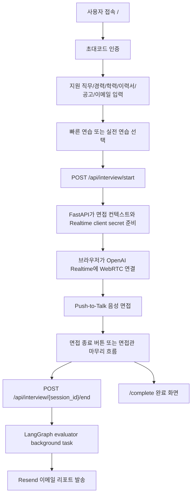

# TechTree User Flow

TechTree의 기본 사용자 흐름은 **초대코드 인증 → 정보 입력 → Realtime 음성 면접 → 완료 화면 → 이메일 리포트**입니다.



## 1. Entry Point

### Production

```text
https://techtree.haebo.pro
```

운영 요청 경로:

```text
Browser
  -> Nginx HTTPS
  -> Next.js frontend
  -> /api/* reverse proxy
  -> FastAPI backend
  -> OpenAI / MongoDB / Tavily / Resend
```

### Local Development

```text
Frontend: http://localhost:3000
Backend:  http://localhost:8000
Local Docker proxy: http://localhost:8080
```

## 2. Main Screens

| Route | 역할 | 상태 |
| :--- | :--- | :--- |
| `/` | 초대코드 인증, 면접 정보 입력, 서비스 소개 | 기본 시작 화면 |
| `/interview` | OpenAI Realtime WebRTC 음성 면접 | 기본 면접 화면 |
| `/complete` | 면접 종료 후 비동기 리포트/이메일 안내 | 기본 종료 화면 |
| `/result` | localStorage 기반 legacy/manual report view | 보조 화면 |
| `/debug` | 프롬프트, 세션 입력값, 핵심 이벤트, transcript 확인 | 개발자 도구 |

## 3. Invite Flow

1. 프론트엔드는 `GET /api/invite/session`으로 기존 인증 세션을 확인합니다.
2. 인증 세션이 없으면 초대코드 입력 화면만 보여줍니다.
3. 사용자는 초대코드를 입력하고 `POST /api/invite/verify`를 호출합니다.
4. 백엔드는 MongoDB Atlas의 `reflection.invite_codes`에서 `status=active`, `use_count < use_max` 조건을 확인합니다.
5. 성공 시 `use_count`를 증가시키고 HttpOnly session cookie를 발급합니다.
6. 인증 성공 이벤트와 서버 오류는 설정된 경우 Telegram으로 전송됩니다.

초대코드 문서 예시:

```json
{
  "code": "TECHTREE-ABCDEFG",
  "name": "",
  "status": "active",
  "use_max": 1,
  "use_count": 0
}
```

## 4. Input Flow

사용자가 입력하는 값:

- 리포트 받을 이메일
- 지원 직무
- 경력
- 최종 학력
- 이력서 정보
- 채용 공고 정보
- 면접 모드

이력서 입력:

| 방식 | 처리 |
| :--- | :--- |
| PDF | `POST /api/upload/parse-pdf`, PyPDF2 텍스트 추출 |
| TXT | 브라우저에서 텍스트 읽기 |
| 직접 입력 | 입력값 그대로 사용 |
| 없음 | 이력서 없음으로 진행 |

채용 공고 입력:

| 방식 | 처리 |
| :--- | :--- |
| 텍스트 | `POST /api/upload/analyze-jd`로 직무명/요약 분석 |
| 이미지 | base64 또는 data URL 형태로 전달해 이미지 분석 |
| 없음 | 지원 직무와 이력서 중심으로 면접 진행 |

면접 모드:

- `short`: 약 7분 목표, 대표 경험과 핵심 직무 질문 중심
- `long`: 약 20분 목표, 프로젝트/협업/문제해결/기술 선택 이유까지 깊게 확인

## 5. Interview Start Flow

프론트엔드는 입력값을 `sessionStorage.interviewProfile`에 저장한 뒤 `/interview`로 이동합니다.

`/interview`는 다음 API를 호출합니다.

```text
POST /api/interview/start
```

주요 요청 필드:

```ts
{
  user_id,
  report_email,
  job_title,
  education,
  experience,
  resume,
  job_description,
  job_image,
  interview_mode
}
```

백엔드 처리:

1. LangGraph workflow가 manager context를 준비합니다.
2. 채용 공고 텍스트/이미지를 분석해 면접 컨텍스트를 만듭니다.
3. Tavily API가 설정되어 있으면 면접 시작 전 참고용 채용 공고를 준비할 수 있습니다.
4. ReflectionService가 조건에 맞는 reflection/policy 지침 일부를 선택합니다.
5. 모드별 Realtime 시스템 프롬프트를 구성합니다.
6. OpenAI Realtime client secret을 발급합니다.
7. `temp_sessions`에 세션 메타데이터를 저장합니다.

주요 응답 필드:

```ts
{
  session_id,
  ephemeral_token,
  message,
  job_posting_analysis,
  interview_mode,
  prompt_variant,
  guideline_selection
}
```

## 6. Realtime Interview Flow

브라우저는 backend에서 받은 `ephemeral_token`으로 OpenAI Realtime에 직접 WebRTC 연결합니다.

```text
Browser
  -> OpenAI Realtime WebRTC
  -> remote audio track 수신
  -> data channel event 송수신
```

현재 설정:

- 모델: `gpt-realtime-mini-2025-12-15`
- 음성 transcription: `whisper-1`
- `turn_detection`: 비활성화
- 답변 방식: Space 기반 Push-to-Talk

Push-to-Talk 동작:

1. Space key down: 마이크 track enable, `input_audio_buffer.clear`
2. Space key up: 마이크 track disable, `input_audio_buffer.commit`
3. 이어서 `response.create`를 보내 면접관 답변을 요청

공고 이미지가 있는 경우 첫 면접관 응답 이후 Realtime conversation에 이미지 context를 추가합니다.

## 7. Closing Flow

기본 종료는 사용자가 `/interview`의 `면접 종료하기` 버튼을 누르는 방식입니다.

면접관이 마무리 멘트를 시작하면 UI는 종료 가능 상태를 더 명확히 보여줄 수 있습니다. 단, 지원자의 임의 발화만으로 면접을 자동 종료하지 않는 것을 기본 정책으로 둡니다.

종료 API:

```text
POST /api/interview/{session_id}/end
```

payload:

```ts
{
  transcripts: Array<{ role: "user" | "ai"; text: string }>,
  saved_jobs: Array<Record<string, unknown>>,
  tool_traces: Array<Record<string, unknown>>,
  interview_date?: string,
  interview_duration?: string
}
```

응답은 즉시 `queued`를 반환하고, 리포트 생성은 background task에서 처리됩니다.

## 8. Report Flow

백그라운드 처리:

1. transcript를 LangChain message로 변환합니다.
2. LangGraph evaluator가 구조화된 평가 결과를 생성합니다.
3. 평가 결과와 전체 대화 내역을 이메일 HTML로 렌더링합니다.
4. Resend API로 사용자 이메일에 리포트를 발송합니다.
5. 평가 결과와 대화 흐름을 바탕으로 비식별 reflection 후보를 생성합니다.
6. 세션에서 민감한 원문 필드를 정리합니다.

이메일 리포트 주요 내용:

- 종합 점수
- 강점
- 개선점
- 상세 Q&A 분석
- 말투/답변 습관 피드백
- 자기소개 개선안
- 이력서-직무 적합도
- 전체 대화 내역

채용 공고 검색 데이터는 면접 컨텍스트와 tool trace에 보조적으로 활용될 수 있지만, 최종 리포트의 핵심 기능으로 설명하지 않습니다.

## 9. Data Storage Summary

| Data | 저장 위치 | 설명 |
| :--- | :--- | :--- |
| 입력 프로필 | Browser `sessionStorage` | 같은 정보로 다시 연습하기 |
| 초대코드 | MongoDB Atlas `reflection.invite_codes` | 접근 제어 |
| 초대 세션 | HttpOnly session cookie | 브라우저 세션 기준 |
| 면접 세션 메타데이터 | backend in-memory `temp_sessions` | 프로세스 재시작 시 사라질 수 있음 |
| Transcript | 종료 요청과 이메일 리포트 처리에 사용 | 장기 원문 저장 대상 아님 |
| 이력서/공고 원문 | 장기 DB 저장 안 함 | 세션 처리 후 정리 |
| Reflection/Policy | MongoDB 또는 JSONL fallback | 비식별 운영 지침 |
| 이메일 리포트 | Resend 발송 | 사용자가 입력한 이메일로 전송 |

## 10. Production Infrastructure

```text
https://techtree.haebo.pro
  -> Nginx 443 SSL termination
  -> Next.js frontend container:3000

https://techtree.haebo.pro/api/*
  -> Nginx reverse proxy
  -> FastAPI backend container:8000

Browser WebRTC
  -> OpenAI Realtime direct connection
```

배포 구성:

- `backend/Dockerfile`: Python 3.12 backend
- `frontend/Dockerfile`: Node 22 frontend
- `docker-compose.yml`: 운영 구성
- `nginx/default.conf`: HTTPS reverse proxy
- `docker-compose.bootstrap.yml`: 최초 인증서 발급 전 HTTP 구성
- `certbot`: Let's Encrypt 발급/갱신

## 11. Failure / Fallback Cases

| Case | 사용자 경험 | 시스템 동작 |
| :--- | :--- | :--- |
| 초대코드 실패 | 인증 실패 메시지 | 401 또는 503 |
| PDF 파싱 실패 | 직접 입력 안내 | `/api/upload/parse-pdf` 오류 |
| 공고 분석 실패 | 직접 직무 입력 가능 | 빈 job title 또는 fallback summary |
| Realtime 연결 실패 | 연결 실패 안내 | WebRTC 초기화 중단 |
| 면접 종료 API 실패 | 오류 로그 후 재시도 필요 | background task 등록 실패 |
| 이메일 발송 실패 | 기본 UI 상세 재시도 없음 | session status `REPORT_FAILED` |
| Mongo reflection 실패 | 서비스는 계속 진행 | JSONL fallback 또는 지침 없음 |

## 12. Current Gaps

- `/complete`에서 리포트 생성 상태를 조회하는 API/UI가 아직 기본 제공되지 않습니다.
- `temp_sessions`는 in-memory라 운영 확장 시 Redis/Mongo 전환이 필요합니다.
- `/result`는 legacy/manual 화면으로, 기본 이메일 리포트 흐름과 통합 여부를 결정해야 합니다.
- Reflection/Policy 관리 화면은 아직 없습니다.
