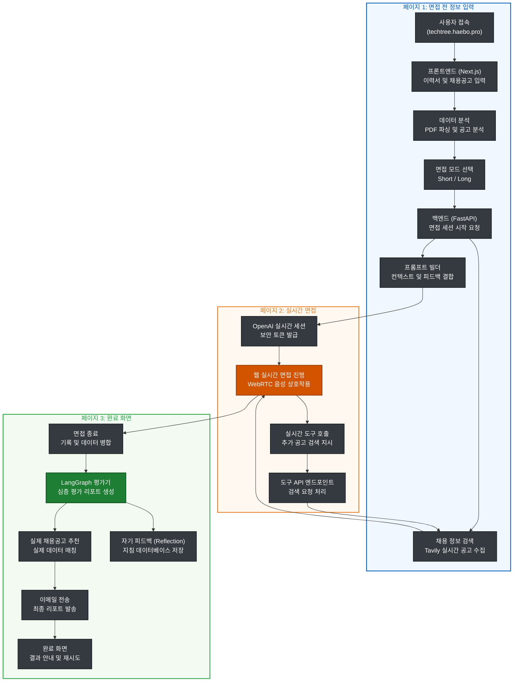

# User Flow

> TechTree의 사용자 흐름 및 시스템 아키텍처 문서입니다.
> 현재 서비스는 AWS 환경에서 **Docker Compose**와 **Nginx**를 통해 컨테이너 기반으로 배포되어 있으며, `https://techtree.haebo.pro` 도메인을 통해 공식 운영 중입니다.

## Core Flow Diagram



## 1. Entry Point

### Production

사용자는 브라우저에서 아래 주소로 서비스에 접근합니다.

```text
https://techtree.haebo.pro
```

배포 환경의 의도된 요청 경로:

```text
User Browser
  -> https://techtree.haebo.pro
  -> Nginx
  -> Next.js frontend
  -> FastAPI backend (/api/*)
  -> OpenAI Realtime / Tavily / Resend / MongoDB
```

### Local Development

현재 로컬 개발 기준:

```text
Frontend: http://localhost:3000
Backend:  http://localhost:8000
```

## 2. Main Screens

| Route | Purpose | Current Status |
| :--- | :--- | :--- |
| `/` | 지원 정보, 이력서, 채용 공고, 리포트 이메일, 면접 모드 입력 | 메인 사용자 시작 화면 |
| `/interview` | OpenAI Realtime WebRTC 기반 음성 면접 진행 | 메인 면접 화면 |
| `/complete` | 면접 종료 후 비동기 리포트 생성/이메일 발송 안내 | 현재 기본 종료 화면 |
| `/result` | 브라우저 localStorage 기반 리포트 조회 및 수동 이메일 발송 | 이전/보조 흐름. 현재 기본 종료 흐름에서는 `/complete` 사용 |
| `/debug` | Realtime 연결, tool call, 업로드 분석 확인 | 개발자용 디버그 화면 |

## 3. User Journey

### Step 1. 사용자가 메인 화면에 접속

사용자는 `https://techtree.haebo.pro`에 접속해 TechTree 메인 화면(`/`)을 봅니다.

사용자가 입력하는 정보:

- 리포트를 받을 이메일
- 지원 직무
- 경력
- 최종 학력
- 이력서 정보
- 채용 공고 정보
- 면접 모드

면접 모드:

- `short`: 대표 경험과 핵심 직무 질문을 짧고 밀도 있게 점검하는 빠른 연습
- `long`: 직무 역량, 프로젝트, 협업/문제 해결, 기술 선택 이유까지 깊게 확인하는 실전 연습

### Step 2. 이력서 입력

사용자는 이력서를 아래 방식 중 하나로 제공합니다.

| Input | Frontend Behavior | Backend/API |
| :--- | :--- | :--- |
| PDF 업로드 | 파일을 `FormData`로 전송 | `POST /api/upload/parse-pdf` |
| TXT 업로드 | 브라우저에서 텍스트를 직접 읽음 | 백엔드 호출 없음 |
| 직접 입력 | 입력 텍스트를 그대로 사용 | 백엔드 호출 없음 |
| 이력서 없음 | `"이력서 없음"`으로 프로필 구성 | 백엔드 호출 없음 |

PDF 처리:

```text
frontend/app/page.tsx
  -> POST /api/upload/parse-pdf
  -> backend/app/api/upload.py
  -> PyPDF2로 텍스트 추출
```

이미지 기반 PDF는 현재 OCR 대상이 아닙니다. 텍스트 추출에 실패하면 사용자는 직접 입력으로 전환합니다.

### Step 3. 채용 공고 입력 및 직무 자동 추출

사용자는 채용 공고를 텍스트 또는 이미지로 제공합니다.

| Input | Frontend Behavior | Backend/API |
| :--- | :--- | :--- |
| 공고 텍스트 | 일정 길이 이상 입력 시 자동 분석 | `POST /api/upload/analyze-jd` |
| 공고 이미지 | 이미지 압축 후 base64 저장, HEIC는 JPEG 변환 시도 | `POST /api/upload/analyze-jd` |
| 공고 없음 | 맞춤형 공고 정보 없이 진행 | 백엔드 분석 없음 |

공고 분석 목적:

- 지원 직무명을 자동 추출해 `job_title`에 채움
- 면접 시작 후 공고 요건을 질문 맥락에 반영

사용 모델:

```text
gpt-5.4-nano
```

### Step 4. 사용자가 면접 시작

사용자가 빠른 연습 또는 실전 연습을 시작하면 프론트엔드는 입력값을 `sessionStorage`에 저장하고 `/interview`로 이동합니다.

저장되는 주요 값:

```ts
{
  report_email,
  job_title,
  experience,
  education,
  resume,
  job_description,
  job_image,
  interview_mode
}
```

검증 조건:

- 지원 직무, 경력, 학력은 필수
- 리포트 이메일은 올바른 이메일 형식이어야 함
- PDF/공고 분석 중이면 면접 시작을 잠시 막음

## 4. Interview Session Flow

### Step 1. 면접 페이지가 백엔드 세션을 생성

`/interview` 페이지는 `sessionStorage`의 프로필을 읽고 백엔드에 면접 시작을 요청합니다.

```text
POST /api/interview/start
```

요청 주요 필드:

- `user_id`
- `report_email`
- `job_title`
- `education`
- `experience`
- `resume`
- `job_description`
- `job_image`
- `interview_mode`

백엔드 처리:

1. 채용 공고 텍스트/이미지 요약을 준비합니다.
2. Tavily API 키가 있으면 면접 시작 전 모집중 공고를 검색합니다.
3. ReflectionService가 직무/경력/학력/모드에 맞는 운영 지침을 선택합니다.
4. `short` 또는 `long` 모드에 맞는 Realtime 시스템 프롬프트를 생성합니다.
5. OpenAI Realtime 세션을 생성하고 ephemeral token을 발급합니다.
6. LangGraph state에 초기 세션 상태를 저장합니다.

응답 주요 필드:

```ts
{
  session_id,
  ephemeral_token,
  prepared_jobs,
  job_posting_analysis,
  interview_mode,
  prompt_variant,
  guideline_selection
}
```

### Step 2. 브라우저가 OpenAI Realtime에 WebRTC로 연결

프론트엔드는 백엔드에서 받은 ephemeral token으로 OpenAI Realtime에 직접 연결합니다.

```text
Browser
  -> POST https://api.openai.com/v1/realtime?model=gpt-realtime-mini-2025-12-15
  -> SDP answer 수신
  -> WebRTC 연결 수립
```

사용 모델:

```text
gpt-realtime-mini-2025-12-15
```

음성 transcript:

```text
whisper-1
```

현재 면접 UX:

- 마이크 권한을 요청합니다.
- 마이크 트랙은 기본적으로 꺼져 있습니다.
- 사용자가 `Space`를 누르고 있는 동안만 마이크가 켜집니다.
- 사용자가 `Space`에서 손을 떼면 오디오 버퍼를 commit하고 AI 응답을 요청합니다.
- `turn_detection`은 비활성화되어 있으며, 프론트엔드가 수동으로 `input_audio_buffer.commit`과 `response.create`를 보냅니다.

### Step 3. 첫 응답과 공고 이미지 후속 주입

Data channel이 열리면 프론트엔드는 첫 면접관 응답을 수동 요청합니다.

```json
{ "type": "response.create" }
```

채용 공고 이미지가 있는 경우:

1. 첫 AI 응답이 끝난 뒤
2. 프론트엔드가 이미지와 설명 텍스트를 Realtime conversation에 추가합니다.
3. 이후 면접관은 해당 공고 이미지를 맥락으로 참고할 수 있습니다.

## 5. Realtime Tool Call Flow

면접 중 Realtime 모델은 필요하면 `search_job_postings` tool call을 생성합니다.

```text
OpenAI Realtime
  -> response.function_call_arguments.done
  -> frontend/app/interview/page.tsx
  -> POST /api/interview/{session_id}/tools/search_job
  -> backend/app/engine/tools/job_search.py
  -> Tavily API
  -> structured job postings
  -> function_call_output
  -> OpenAI Realtime response.create
```

검색 결과 shape:

```ts
Array<{
  company: string;
  title: string;
  url: string;
  content?: string;
  deadline_status?: string;
}>
```

중요 원칙:

- 최종 리포트의 추천 공고는 LLM이 생성하지 않습니다.
- 프론트엔드는 검색 결과를 `savedJobsRef.current`에 누적합니다.
- 면접 종료 시 `saved_jobs`로 백엔드에 전달합니다.
- 평가 노드는 LLM의 `job_recommendations`를 버리고 실제 수집된 공고만 주입합니다.

## 6. Interview Closing Flow

사용자는 언제든 `/interview` 화면의 `면접 종료하기` 버튼을 누를 수 있습니다.

자동 종료 감지:

- 사용자가 “면접을 종료하겠습니다”, “그만하겠습니다” 등 종료 의사를 말하면 종료 예정 상태로 전환합니다.
- 면접관의 마무리 멘트가 감지되면 일정 시간 후 자동으로 종료 API를 호출합니다.
- 면접관 transcript에서 마무리 표현이 감지되어도 자동 종료가 예약됩니다.

종료 시 프론트엔드가 백엔드로 보내는 데이터:

```text
POST /api/interview/{session_id}/end
```

payload:

```ts
{
  transcripts: Array<{ role: "user" | "ai"; text: string }>;
  saved_jobs: Array<Record<string, unknown>>;
  tool_traces: Array<Record<string, unknown>>;
  interview_date: string;
  interview_duration: string;
}
```

## 7. Report Generation Flow

`POST /api/interview/{session_id}/end`가 호출되면 백엔드는 즉시 `queued` 응답을 반환하고, 리포트 생성은 FastAPI `BackgroundTasks`로 진행합니다.

백그라운드 처리:

1. LangGraph state에 transcript, saved jobs, tool traces를 반영합니다.
2. evaluator node가 구조화된 평가 리포트를 생성합니다.
3. 실제 검색/수집된 공고를 `job_recommendations`에 강제 주입합니다.
4. Resend API로 이메일 리포트를 발송합니다.
5. 면접 결과를 바탕으로 reflection 후보를 생성하고 저장합니다.
6. 세션에서 민감한 원문 데이터 일부를 정리합니다.

평가 리포트 주요 필드:

- 종합 점수
- 강점
- 개선점
- 주요 Q&A 피드백
- 말투/답변 습관 피드백
- 자기소개 개선안
- 이력서-직무 적합도
- 맞춤 채용 공고
- 전체 대화 내역

사용 모델:

```text
gpt-4.1
```

## 8. Completion Page

면접 종료 API 호출 후 사용자는 `/complete`로 이동합니다.

사용자에게 보여주는 내용:

- 면접 종료 안내
- 리포트가 비동기로 생성되어 입력한 이메일로 전송된다는 안내
- 같은 정보로 다시 연습하기
- 새 정보로 시작하기

데이터 보관 정책:

- 입력한 이력서와 공고 원문은 DB에 저장하지 않는다는 안내를 표시합니다.
- 브라우저 `sessionStorage`에는 같은 정보로 다시 연습하기를 위해 `interviewProfile`이 남을 수 있습니다.
- 새 정보로 시작하면 관련 browser storage를 제거합니다.

## 9. Legacy / Auxiliary Result Page

`/result` 페이지는 `localStorage`의 `interviewResult`를 읽어 리포트를 화면에 보여주고, 사용자가 이메일을 직접 입력해 수동 발송할 수 있는 보조 화면입니다.

현재 기본 면접 종료 흐름은 `/complete`입니다.

정리 필요 사항:

- 서버에서 비동기 리포트 생성 후 프론트 화면에서 결과를 직접 조회하는 API는 아직 기본 흐름에 연결되어 있지 않습니다.
- `/result`를 계속 유지하려면 리포트 상태 조회 API 또는 결과 저장소가 필요합니다.
- 이메일 발송 흐름이 `/complete`의 자동 발송과 `/result`의 수동 발송으로 나뉘어 있으므로, 제품 정책에 맞춰 하나로 정리할 필요가 있습니다.

## 10. Data Storage Summary

| Data | Current Storage | Notes |
| :--- | :--- | :--- |
| 입력 프로필 | Browser `sessionStorage` | 같은 정보로 다시 연습하기에 사용 |
| Realtime session metadata | Backend in-memory `temp_sessions` | 프로세스 재시작 시 사라짐 |
| LangGraph state | LangGraph checkpointer/state | 세션 평가 흐름에 사용 |
| Transcript | 면접 종료 시 백엔드로 전달 | 이메일 리포트와 reflection 생성에 사용 |
| Resume/JD original text | DB 저장 안 함 | 세션 처리 후 정리 대상 |
| Saved job postings | 프론트 ref + backend state | 최종 추천 공고에 사용 |
| Reflection/Policy | JSONL 또는 MongoDB | 운영 지침 재사용 |
| Email report | Resend로 발송 | 수신자는 사용자가 입력한 이메일 |

## 11. Production Infrastructure

> 서비스는 `https://techtree.haebo.pro` 도메인을 통해 전 세계 어디서든 접근 가능하며, 아래와 같은 인프라 구조로 운영됩니다.

**운영 환경 라우팅 구성:**

```text
https://techtree.haebo.pro/ (Port 443)
  -> Nginx (SSL Termination)
  -> Next.js Frontend (Container:3000)

https://techtree.haebo.pro/api/*
  -> Nginx Reverse Proxy
  -> FastAPI Backend (Container:8000)

Browser WebRTC Stream
  -> OpenAI Realtime API (Direct Connection)
```

**핵심 운영 설정:**

- **SSL**: Let's Encrypt 및 Certbot을 통한 자동 갱신 적용.
- **CORS**: 백엔드 API는 공식 도메인(`techtree.haebo.pro`)의 요청만 허용하도록 보안 설정.
- **Secrets**: 모든 외부 API Key(OpenAI, Tavily, Resend 등)는 Docker 환경 변수로 안전하게 주입.
- **Monitoring**: Docker 컨테이너 로그 및 Telegram 알림 봇을 통한 실시간 모니터링 수행.

## 12. Failure / Fallback Cases

| Case | User-facing Behavior | System Behavior |
| :--- | :--- | :--- |
| PDF 파싱 실패 | 직접 입력 안내 | `/api/upload/parse-pdf` 오류 반환 |
| 공고 분석 실패 | 사용자가 직접 직무 입력 가능 | `/api/upload/analyze-jd`는 빈 job title 반환 |
| Tavily API key 없음 | 추천 공고 없이 면접 진행 | 검색 tool trace에 실패 사유 기록 |
| Realtime 연결 실패 | “면접관 연결에 실패했습니다.” 표시 | WebRTC 초기화 중단 |
| 면접 종료 API 실패 | `/complete`로 이동 | 콘솔에 종료 에러 기록 |
| 이메일 발송 실패 | 현재 기본 UI에서는 상세 재시도 화면 없음 | backend session status가 `REPORT_FAILED`로 기록될 수 있음 |

## 13. Operational Considerations & Gaps

- **리포트 상태 조회**: `/complete` 페이지에서 리포트 생성 완료 여부를 실시간으로 확인하는 UI 고도화가 필요합니다.
- **결과 페이지 통합**: `/result` 페이지의 수동 조회 흐름을 `/complete`의 자동 발송 흐름과 통합하는 UX 개선이 필요합니다.
- **세션 영속성**: 현재 `temp_sessions`는 in-memory 방식이므로, 대규모 사용자 대응을 위해 Redis 등으로의 전환을 검토 중입니다.
- **데이터 보관 정책**: 사용자 개인정보 보호를 위해 일정 기간이 지난 세션 데이터를 자동 파기하는 스케줄러 도입이 필요합니다.
